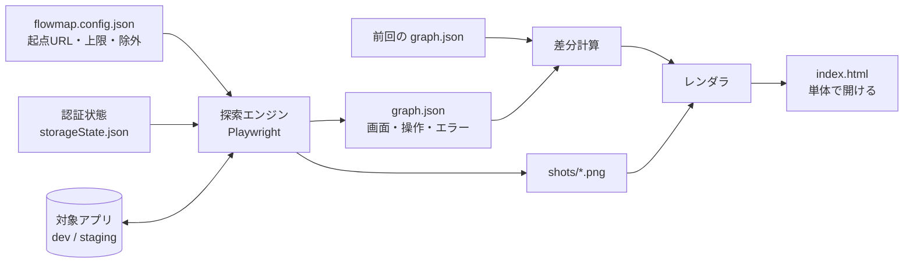
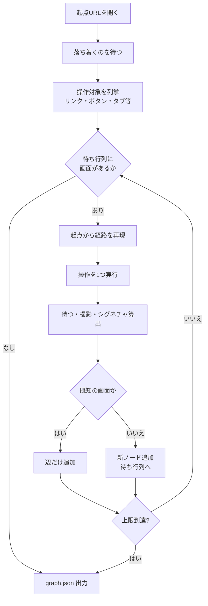
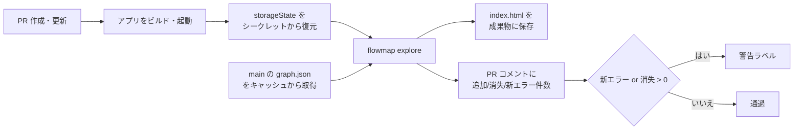

# flowmap 設計書

Sep 24, 2026 · @raku1chi

## 1. 目的と背景

flowmap は、SPA を自動探索して画面遷移をフローチャートとスクリーンショットで一望し、AI 駆動開発で追いつかなくなった動作確認を「見る」作業に変えるツールである。

開発速度が上がった一方、変更のたびに全画面を手で辿る確認が追いつかず、別の画面が壊れたことに後で気づく状況が起きている。Playwright でテストを書けば防げるが、爆速で変わるコードに対してキャプチャや期待値のコードを書き続けるコストが見合わない。

そこで「テストを書く」代わりに「アプリを渡すと勝手に全画面を辿って撮ってくる」道具を置く。かまいたちの夜のフローチャートのように、どの操作でどの画面に行き、そこで何が起きているかを見渡せる状態が目標である。ただし全画面を 1 枚の図に描くと画面数に応じて矢印が増えて読めなくなるため、全画面の木は索引に留め、読む単位は「グループ（画面のまとまり）とグループの間の関係」「1 本の操作フロー」に小さく切る。

| 観点 | Playwright Trace Viewer | flowmap |
| --- | --- | --- |
| 入力 | 人が書いたテストコード | URL（と認証状態） |
| 見え方 | 時系列の一本道 | 分岐図（同じ画面は合流） |
| 回帰検知 | アサーションを書いた箇所のみ | 前回実行との差分を全画面で自動表示 |
| 位置づけ | 単体テストの記録 | 目視確認の代替・地図 |

## 2. 対象範囲と前提

対象は自社で開発中の SPA（React／Vue 等）で、ローカル開発サーバーまたはテスト DB を向いたステージング環境に対して実行する。本番環境には向けない。

| 項目 | 内容 |
| --- | --- |
| 対象アプリ | ブラウザで動く Web アプリ。SPA 中心、サーバーレンダリングも可 |
| 実行環境 | Node.js 20 以上、Playwright（Chromium）。開発者 PC または CI |
| 実装言語 | TypeScript |
| 利用者 | 開発者本人。将来はレビュアー・非エンジニアが index.html を見るだけの利用も想定 |
| 入力 | 起点 URL、設定ファイル、（任意）認証状態ファイル |
| 出力 | graph.json、画面ごとの PNG、単体で開ける index.html |
| 対象外 | ネイティブアプリ、ホバー・ドラッグ・キー操作で出る UI、複数ユーザーの同時操作、本番データ |

前提として、探索中に押した操作は実際にサーバーへ届く。送信・登録系の操作は自動入力値で 1 パターンだけ実行するため、データが増えることを許容できる環境が必要である。

## 3. 全体構成

探索エンジン・グラフモデル・ビューアの 3 層に分け、間を graph.json で切る。ビューアは graph.json だけから描けるので、探索をやり直さずに見た目だけ直せる。



探索エンジンが対象アプリを辿って graph.json と PNG を出し、前回の graph.json と比べた差分を付けてレンダラが index.html を生成する。

| モジュール | 役割 | 主なファイル |
| --- | --- | --- |
| 設定 | 設定ファイルの読み込みと既定値、CLI 引数による上書き | types.ts |
| 正規化 | URL のデータ区間、クエリの扱い、骨格の算出、同じ形の操作の畳み込み（§5） | normalize.ts |
| Jev 判定（任意） | 操作の危険判定、画面の合流判定、データ区間の確認。答えのキャッシュ（§5） | jev.ts |
| 探索エンジン | ブラウザ操作、操作対象の列挙、画面の同定、撮影、エラー収集、差分計算 | explore.ts |
| レンダラ | graph.json からフローチャート HTML を生成 | render.ts |
| CLI | explore／render の 2 コマンド | cli.ts |

CLI は `flowmap explore --url <起点>` と `flowmap render <実行ディレクトリ>` の 2 つに絞る。

## 4. 探索エンジン

探索は幅優先で、各画面の操作対象を 1 つずつ試し、着いた先が新しい画面なら待ち行列に入れる。次の操作を試すときは起点から経路を再現して元の画面に戻る。



起点から再現するのは、SPA では履歴の戻りが状態を正しく戻さないことが多いためである。遅くなる代わりに、どの画面にも決定的な経路で到達できる。ただし再現は探索時間の大半（実測で 7 割）を占めるので、操作のあとに**検証付きの「戻る」**を試す（`useBackNavigation`、既定 true）。URL が変わっていればブラウザの戻るを 1 回だけ使い、戻った先のシグネチャが元の画面と一致したときだけ次の操作にそのまま進む。一致しなければ起点から再現する。同じ URL 上の状態変化（モーダル、開閉）や、操作が画面を変えなかった場合は戻るを使わない（後者はその場に留まる）。正しさは常にシグネチャの一致で担保し、戻るは近道でしかない。

### 操作対象の列挙

可視の `a[href]`、`button`、`role=button|tab|menuitem|link`、`input[type=submit|button]`、`summary`、`onclick` 付き要素を対象にする。可視とは、大きさがあり `display:none` や `visibility:hidden` でなく、ビューポート内なら中心点が他の要素（モーダルのオーバーレイ等）に覆われていないこと。ビューポート外の要素には重なり検査をしない（画面端の座標で代用すると開閉やスクロールのたびに結果が変わり、骨格が不安定になる）。ラベルは aria-label → innerText → value → title → img alt の優先順で決め、同じラベルが複数あれば出現順の番号で区別する。

除外は 3 種類で、ラベル文言（ログアウト・削除・退会）、セレクタ（`[data-flowmap-ignore]`）、URL パターン（`/logout`、`mailto:`、`tel:`）である。

全画面にあるヘッダのドロップダウンのような開閉 UI は、画面ごとに開くと全ノードが 2 倍になる。リンクでない操作を role とラベルで束ね、別々の画面から `maxLocalActionRepeats`（既定 2）回試して毎回「同じルート内の状態変化」しか起きなければ共通の開閉 UI とみなし、以後の画面では試さない。最初の数画面では開いた状態を撮るので、その中身の操作は探索される。

試す順番と件数は `maxActionsPerPattern` で整える。同じ形の操作（行き先の正規化ルートが同じリンク、同じラベルのボタン）は 1 画面につき 3 件までに絞り、形ごとに 1 件ずつ順繰りに並べてから `maxActionsPerState` で切る。一覧の同種リンクが先頭を占めて他の操作に予算が回らない事態を避けるためで、ZAP の Maximum children に相当する。

### 操作の実行

1. 画面内のフォーム項目を設定値で自動入力する（既に値があるものは触らない）。select は 2 番目の選択肢、checkbox・radio は変更しない
2. 列挙と同じ規則で対象要素を見つけ直し、印を付けてクリックする（4 秒でタイムアウト）。見つからなければ、ラベルの数字（件数・ページ番号。桁区切りを含む）を潰して探し直す。データ区間のリンク（企業名など）がデータの入れ替わりで一覧から消えていれば、行き先が同じ形の別のリンクで代用する
3. `domcontentloaded` → `networkidle`（最大 3 秒）→ 設定の待ち時間（既定 600 ms）の順に待つ。さらに撮影時は、骨格（見出し・操作対象・フォーム項目・本文長）の指紋が 250 ms おきに 2 回続けて同じになるまで撮り直す（上限 `stabilizeMs`）。networkidle の後に一覧を描画するアプリでは、これがないと読み込み途中の骨格で撮れて同じ画面が分裂する
4. 別タブが開いたら閉じ、ダイアログは受け入れ、ダウンロードは拒否する

### 収集する情報

画面ごとに、URL、タイトル、スクリーンショット（ビューポート）、本文テキストのハッシュ、コンソールエラー（`console.error`・`pageerror`）、失敗したリクエスト（接続失敗と 4xx／5xx 応答）を記録する。既知の画面に再訪した場合もエラーは追記する。

### 上限と停止条件

| 条件 | 既定 | 到達時の扱い |
| --- | --- | --- |
| 画面数 | 60 | 探索を停止し、理由を graph.json に記録 |
| クリックの深さ | 6 | その画面の先は辿らず「深さ上限」として表示 |
| 1 画面あたりの操作数 | 25 | 超過分は試さず「n 件中 m 件のみ試行」と表示 |
| 対象外オリジン | — | 外部サイトは撮影のみ、操作は列挙しない |

## 5. 画面の同定（シグネチャ）

「同じ画面か」は URL と画面の骨格から作るシグネチャで判定し、`/items/12` と `/items/34` のような ID 違いを 1 ノードに合流させる。この判定が甘いとノードが無限に増え、厳しいと別画面がまとめられるので、設計の要である。

```latex
\mathrm{signature} = \mathrm{sha1}\bigl(\mathrm{normalize}(\mathrm{path}) \;\Vert\; \mathrm{structure}\bigr)
```

| 要素 | 内容 | 正規化 |
| --- | --- | --- |
| path | pathname（デコード済み） | 連続する数字を `#` に置換（UUID も数字部分が潰れる）。さらに「データ区間」を `*` に置換（後述） |
| query | クエリ文字列 | 既定はパラメータ名だけを残し値は捨てる（`queryParams: names`）。`structuralParams` に挙げた名前は値も残す |
| structure | 可視の見出し（h1〜h3）、操作対象、フォーム項目の type・name | 数字を `#` に置換。操作対象はリンクなら行き先の正規化ルート（別オリジンはホスト名だけ）、それ以外はラベルで表し、**同じ形のものは 1 つに畳んで並べ替える**（DOM の出現順に依存させない）。見出しとラベルからはデータ区間の値を消す |
| 外部サイト | URL そのまま | 撮影のみ、structure は使わない |

### データ区間

`/companies/サービス業` と `/companies/小売業` のように、同じテンプレートに違うデータを流し込んだ画面を 1 ノードに合流させるため、URL パスの「データを表す区間」を `*` に置き換える。ZAP の Data Driven Content と同じ発想で、決め方は 2 つある。実装は `src/normalize.ts`。

1. **設定で宣言する。** `pathRules` に正規表現と置換を書く（`^/companies/[^/]+` → `/companies/*`）。
2. **自動で学習する。** 1 つの画面に「1 区間だけ違う同じ形の href」が `autoPathRulesMinSiblings`（既定 3）本以上並んでいれば、その区間をデータとみなす。先頭区間（`/about` `/contact` のようなトップレベルの経路）は対象にしない。学習した区間は graph.json の `meta.learnedPathRules` に残るので、`pathRules` に書き写せば次回から明示的になる。

データ区間の値（`サービス業`）は見出しやラベルからも消すので、「サービス業の企業一覧」と「小売業の企業一覧」は同じ骨格になる。値が URL に現れない場合（`/company/1234` の h1 が企業名）に備えて、データ区間を持つルートでは h1 の文言を骨格に入れず「h1 がある」ことだけを残す。h2 以下は残すので、同じ詳細画面のタブや節の違いは区別できる。合流したノードには最初に到達した URL 以外を `mergedUrls` として記録し、ビューアで「何が畳まれたか」を見せる。

自動学習は探索の途中で起きるため、ルールが学習される前に撮った画面は正規化されないままになる（親画面より先に単独のリンクから到達した場合など）。その画面は同じテンプレートの別ノードとして 1 つ余分に残る。同じアプリを同じ設定で回せば学習の順序も同じなので、実行間の比較には影響しない。

シグネチャとは別に、本文テキストのハッシュ（textHash）を持つ。シグネチャが同じで textHash が違う画面は、次回実行との比較で「変化」として扱う。

既知の問題と対処方針は次のとおり。

| 問題 | 症状 | 対処 |
| --- | --- | --- |
| モーダル・トースト | 出ている間だけ骨格が変わり別画面扱いになる | 想定どおり別ノードにする（モーダルも見たい画面）。トーストは待ち時間で消える |
| 一覧の件数差 | 行ごとにリンクがあると件数で骨格が変わる | 同じ形の操作対象は骨格上 1 つに畳むので、件数が変わっても骨格は同じ |
| タブ切替 | URL 不変で内容だけ変わる | 骨格に見出しと操作対象が入るので別ノードになる。意図どおり |
| ランダムな ID や slug を含む href | 数字以外の値は潰れない | 同じ形のリンクが 3 本以上並べば自動学習で潰れる。単独なら `pathRules` で宣言する |
| 兄弟ページの誤合流 | `/settings/profile` `/settings/security` のような別画面が同じ区間として学習される | 骨格（見出し・フォーム項目）が違えば別ノードのまま。骨格まで同じ画面だけが合流する。Jev を有効にすると、候補を Jev が認めたときだけ学習する |
| データで骨格が変わる詳細画面 | 開示項目の有無などで同じテンプレートの画面が分かれる | Jev を有効にすると、同じ区画の既存画面と比べて合流させる |

### Jev による判定（任意）

意味が分からないと判断できない 3 か所に、[Jev](https://docs.typesafe.ai/introduction)（TypeSafe の型付き判定モデル）の判定を足せる。既定は無効で、`jev.enabled` か `--jev` で有効にする。機械的ルールを置き換えず、**押さない操作を増やす方向と、合流を増やす方向にだけ**働く。実装は `src/jev.ts`、問いと閾値の根拠は `experiments/jev/README.md` の試験結果（正解付き 93 ケースで、危険な操作の見逃しと誤った合流が 0 件）。

| 判定 | いつ聞くか | 問い（Noul） | 使い方 |
| --- | --- | --- | --- |
| 操作 | 新しい画面の試す操作を決めたとき | その操作はサーバーのデータを作る・変える・消す、または誰かに何かを送るか | 日英の問いのどちらかが `actionThreshold`（0.5）以上なら押さない。リンクは 0.7 以上のときだけ |
| 画面 | 未知のシグネチャの画面を撮ったとき | 種類と目的が同じ画面か／違いは UI 操作による表示の切り替えか | 同じ区画（先頭のパス区間が同じ）の既存ノード最大 8 件と比べ、min(種類が同じ, 1 − UI 操作) が `mergeThreshold`（0.7）以上なら合流 |
| データ区間 | 機械的ルールが候補を見つけたとき | 兄弟リンクはどれも同じ作りの画面を別データについて開くか | 日英の問いがともに `mergeThreshold` 以上なら学習、そうでなければ見送る |

- **コードで決められることは聞かない。** 違いのない 2 画面は Jev に聞かず同じ画面とする。タブと開閉（summary）は表示を切り替えるだけなので、操作の判定に回さない（「危険な操作」という名前のタブを危険と判定したため）。
- **要素の性質を閾値に入れる。** リンクは GET の遷移で、HTTP の約束ではデータを変えない。GET でデータを変える作りのうちよくあるもの（ログアウト・削除）は `denyText`・`denyUrlPatterns` で止まる。ヘッダの「お問い合わせ」リンクを 0.5 前後で危険と判定したため、リンクは 0.7 以上のときだけ止める。
- **1 つの問いに 1 つの判断。** 画面の判定を 1 つの問いにすると、違いのない 2 画面を「別のデータではない」と字義どおり答えた。種類の問いと UI 操作の問いに分け、コードで組み合わせる。
- **0.5 付近で決めない。** 値は同じ入力でも実行ごとに最大 0.07 ほど揺れる。合流は画面を見落とす側の誤りなので 0.7 以上に限り、操作は押してしまう側の誤りなので 0.5 以上で止める。
- **答えはキャッシュする。** `(モデル, 問い, state)` のハッシュで `outDir/jev-cache.json` に保存し、同じ画面には同じ答えを返す。値の揺れで実行間の比較が崩れないようにするため。
- **合流させた画面は別名として残す。** 合流元のシグネチャはノードの `aliasSignatures` に入り、次回以降の到達でもそのノードに合流する。実行間の比較（§10）もこれを含めて突き合わせる。比べる相手は各ノードの代表なので、A≈B・B≈C から A と C が繋がることはない。
- **失敗したら機械的ルールで進める。** 問い合わせに失敗した判定はその場で機械的ルールに任せ、回数を `meta.jev.errors` に残す。キーが無い・通らないときは探索を始めずに止める。

1 つの画面あたり、操作の判定が数件から 20 件ほど、合流の判定が最大 8 件増える。応答は中央値 0.2 秒で 4 本ずつ並行に投げ、費用は 1 回の探索で 1 セント未満。送る内容は §7 のとおり。

## 6. 認証・セッションの扱い

認証は探索エンジンの外で済ませ、ログイン済みのブラウザ状態（Playwright の storageState）を渡して探索する。ツール自身にログイン手順を持たせないことで、ID・パスワードを設定ファイルに書かずに済み、SSO・二要素・reCAPTCHA など自動化しにくい認証にも同じ方法で対応できる。

### 方式の比較

| 方式 | 手順 | 向く場面 | 難点 |
| --- | --- | --- | --- |
| storageState 再利用（採用） | `npx playwright codegen --save-storage=auth.json <URL>` で一度手でログインし、`--storage auth.json` で渡す | 通常のログイン、SSO、二要素あり | セッション期限が切れると再取得が要る |
| セットアップスクリプト | `auth.setup.ts` にログイン操作を書き、探索前に自動実行して storageState を作る | CI で毎回無人実行したい | パスワードを環境変数で渡す必要。認証 UI が変わると壊れる |
| 認証をバイパスするテスト用入口 | 開発環境だけ有効なテストログイン API や固定トークンをアプリ側に用意する | 自社アプリ、CI 常用 | アプリ側の対応が要る。本番に混入させない仕組みが必須 |
| ヘッダ・Cookie の直接注入 | `extraHTTPHeaders` や `context.addCookies` でトークンを渡す | API キー型、Basic 認証 | トークンの取得元が別に要る |

### 探索中の考慮点

- **ログアウト操作を押さない**: `denyText` と `denyUrlPatterns` で除外する。押すと以後の全操作がログイン画面に落ちる
- **セッション切れの検知**: 探索の途中でシグネチャがログイン画面のものになった回数を数え、連続で N 回（既定 3）続いたら「認証切れ」として探索を停止し、理由を graph.json に残す。ログイン画面のシグネチャは起点到達直後に storageState なしで開いた場合の画面として自動取得するか、設定で URL を指定する
- **起点から再現する方式との相性**: 各操作の前に起点へ戻るが、ブラウザコンテキストは維持するので Cookie と localStorage は保たれる。ログインは 1 回で済む
- **ロール別の探索**: 管理者・一般ユーザーなど権限で見える画面が違う場合、storageState を分けて別々に実行し、実行ディレクトリ名にロールを含める。同一ロール内でのみ差分を取る
- **CSRF・ワンタイムトークン**: ページ内に埋め込まれたトークンはそのページのフォームで使うので問題ない。ページ再取得のたびに変わるトークンは、起点から再現する方式のおかげで常に最新の値になる

### 認証情報の取り扱い

storageState ファイルは Cookie とトークンを平文で含むので、`.gitignore` に入れ、CI では暗号化シークレットとして渡す。生成した index.html と graph.json には認証情報を含めない（URL のクエリにトークンが乗る設計のアプリでは、URL 表示時にマスクする設定を用意する）。

### 認証が必要な画面が起点の場合

起点そのものがログイン画面に飛ばされるアプリでは、storageState なしの実行で「ログイン画面 → 入力 → 送信」の 1 経路だけが探索される。フォームの自動入力値（`fill.email`／`fill.password`）にテストアカウントを入れれば探索エンジンがログインして先へ進めるが、パスワードが設定ファイルに残るため、この方法は推奨しない。storageState 方式を基本とする。

## 7. 安全設計

探索は本物のクリックと送信を行うので、壊してよい環境に対してだけ動くよう、ツール側と運用側の両方で歯止めをかける。

| 層 | 対策 | 既定 |
| --- | --- | --- |
| 操作の除外 | 削除・退会・ログアウト・支払い系の文言を含む操作は押さない | `denyText`: ログアウト、削除、退会、logout, sign out, delete |
| 要素の除外 | 開発者が `data-flowmap-ignore` 属性を付けた要素は押さない | 有効 |
| 意味による除外（任意） | Jev が「サーバーのデータを変える」と判定した操作は押さない（§5）。フォームの送信や保存も押さなくなる | 無効（`jev.enabled`） |
| URL の除外 | `/logout`、`mailto:`、`tel:` へは遷移しない | 有効 |
| オリジン制限 | 起点と別オリジンは撮影のみ、操作しない | 有効 |
| 送信の抑制 | `allowSubmit: false` で submit 種別の操作を全て除外できる（追加予定） | true |
| 環境の確認 | 起点 URL が localhost・127.0.0.1・`*.local`・設定の許可ホスト以外なら確認を求める（追加予定） | — |
| 上限 | 画面数・深さ・操作数・タイムアウトで暴走を止める | 60／6／25／4 秒 |

除外文言は日本語と英語の両方を既定に含めるが、アプリ固有の危険な操作（「承認」「出荷」「送金」など）は利用者が設定に足す。README にこの点を明記し、設定ファイルのテンプレートにコメントで例を置く。Jev を有効にすると、こうした文言を設定しなくても意味で除外できる（試験では `denyText` に無い危険な操作 17 件を全て除外した）。フォームの先の画面も地図に載せたいときは `jev.actions` を false にする。

Jev を有効にすると、判定のために画面の要約を typesafe.ai の API に送る。送るのは画面のタイトル・見出し・操作のラベル・フォーム項目の種類と名前・URL のパスとクエリで、クエリのうち token・key・session・auth・code・email などを含む名前の値は `***` に伏せる。認証情報（storageState・Cookie）、スクリーンショット、本文は送らない。社外に出せない内容を表示するアプリでは有効にしない。API キーは環境変数 `TYPESAFE_API_KEY` か `.env` から読み、`flowmap.config.json` には書かない。

探索中のブラウザはヘッドレスで、ダウンロードは拒否、別タブは即閉じ、`alert`／`confirm` は受け入れる。`confirm` を受け入れる挙動は削除系と相性が悪いため、除外文言に頼らず `allowSubmit` と組み合わせて使うことを推奨する。

## 8. ビューア

ビューアは外部ライブラリなしの単体 HTML で、graph.json を埋め込んで生成する。ファイルを開くだけで動き、CI の成果物としてそのまま共有できる。

### 画面構成

ビューアは「グループ図（グループの関係図）」「グループ（部分木）」「フロー（コマ割り）」「全画面の木」「問題一覧」の表示を持つ。上位の 3 つ（グループ図・全画面の木・問題一覧）はヘッダの切替で並び、グループとフローはそこから中に入る形で、パンくず（出発点 › グループ › フロー）と Esc で戻る。着地は画面数で決め、40 画面以下ならコンパクトな全画面の木、それより多ければグループ図にする。木はサムネイルを消すと構造が読めるため、グループの中も全画面の木も既定でサムネイルなし（ヘッダの「サムネイルを表示」で出す）。右パネルは表示に応じて概要・グループの情報・画面の詳細を出す。表示の切り替え（グループ・フロー・コマ・画面の選択）は URL のハッシュに載せて history に積み、ブラウザの戻る／進むと直リンクを効かせる（`#g=<グループ>&s=<画面>`、`#f=<フロー>&k=<コマ>`、`#map`）。ハッシュを使うのは file:// で開いても動かすためである。

```
グループ図                                              グループ（設定）
┌──────┐        ┌────────────┐                     ┌────┐ ─設定─▶ ┌────┐ ─〈通知設定〉─▶ ┌────┐
│ 起点 │─商品一覧─▶│ 商品一覧 2画面 │ …               │起点│         │一般│ ─〈危険な操作〉▶ ┌────┐
│      │─設定────▶│ 設定 4画面   │                   └────┘         └────┘ ─[保存する]─▶ ┌────┐
└──────┘    ◀‥トップへ‥│ お問い合わせ │                                 └ → 商品一覧のグループへ（札）
フロー（「送信する」を押す → 送信完了）
┌────┐ ─「お問い合わせ」を開く─▶ ┌────┐ ─「送信する」を押す─▶ ┌────┐
│ 1  │                          │ 2  │                       │ 3  │
└────┘                          └────┘                       └────┘
```

| 表示 | 内容 |
| --- | --- |
| ヘッダ | 起点 URL、画面数・グループ数・フロー数・エラー画面数、前回比（追加／消失／変化／新エラー）、所要時間、停止理由、絞り込みボタン。2 段目に表示の切替（グループ図・全画面の木・問題一覧）、パンくず、検索、共通ナビ表示の切替、サムネイル表示の切替、表示倍率、使い方、凡例 |
| グループ図 | グループの関係図。左に起点、右の列にグループのカード（代表画面のサムネイル、画面数、フロー数、含まれる URL、エラー・新規・変化・外部のバッジ）。辺はグループをまたぐ操作をまとめたもので、起点からの入口は太いカギ線、グループからグループへの操作は細線または点線、共通ナビは既定で非表示。右パネルは探索の概要と操作フロー一覧、新エラー・消失・新規・変化の画面 |
| グループ | 起点＋そのグループの部分木を tidy tree で描く。木の枝はカギ線で太く、ラベルは子のすぐ左。他のグループへ渡る操作（共通ナビ以外）は画面の下に「→ グループ名」の札として出し、押すとそのグループへ移動して行き先の画面を選ぶ。右パネルはグループのフロー、エラー画面、他のグループとの出入り。画面を選ぶと詳細 |
| フロー | 木の葉ごとの「起点からそこまでの経路」を 1 本のフローとみなし、最後の操作を動詞形にした名前（「送信する」を押す → 送信完了）で一覧にする。最後の操作がデータのリンク（企業名など）なら行き先の画面名で呼ぶ（「〇〇の働きやすさデータ」を開く）。開くとキャンバスが横一列のコマ割りに変わり、コマ（番号・キャプチャ・画面名・エラー）の間に操作の矢印が入る。← → キーとクリックでコマを進め、右パネルにそのコマの画面の詳細を出す |
| 全画面の木 | 全画面を 1 枚にした木。サムネイルなしが既定で、40 画面以下ならここに着地する。それ以上でも索引として使える |
| 問題一覧 | コンソールエラー・失敗リクエスト・失敗した操作・前回との差分（消失・変化・新規）・探索の打ち切りを画面ごとにまとめた表。深刻度と「前回になかったか」で並べ、種類の絞り込みと「前回になかったものだけ」の切替を持つ。行から画面の詳細とグループ内の位置へ飛べる。ヘッダの「問題一覧 (n)」と、エラー・消失・変化の数字から開く |
| 画面の詳細（右パネル） | 起点からの経路のパンくず、拡大キャプチャ（変化画面は前回と並べる）、グループ・深さ・見出し・シグネチャ、できる操作と行き先（他のグループならグループ名を添える）、ここへ来る操作、この画面を通るフロー、コンソールエラー、失敗リクエスト |

### グループの決め方

起点から直接行ける画面（探索の木で起点の子）ごとに、その部分木を 1 つのグループとする。起点と同じ URL の状態（起点上のモーダルなど）は起点のグループに含める。グループをまたぐ辺のうち共通ナビ（ほぼ全画面から同じ行き先へ向かう操作）は関係図にも札にも出さず、別枠に一覧する。共通ナビを除外しないとグループの関係が完全グラフになり、全画面の木と同じ問題が再現するためである。

グループの所属は幅優先探索の発見順に従う。複数のセクションから辿れる画面は、起点ページで先に列挙されたリンクのグループに入るため、ヘッダのリンク順が変わると画面の所属グループが移ることがある。実アプリで所属が安定しない場合は、URL のパス（数字を正規化）でグループを切る方式に切り替える。

### 画面名

画面名はページのタイトルから作るが、`/company/1234` のような同じテンプレートの画面は、タイトルに企業名や商品名が入っている。これをそのまま使うと、たまたま最初に撮った 1 件の名前で画面全体を呼ぶことになるので、データの部分を「〇〇」に置き換えたテンプレート名（「〇〇の働きやすさデータ」）で表示する。撮影した実例は「例: ＡＩＡＩグループ株式会社 ほか 3 件」としてカードと右パネルに添える。表示だけの処理で、シグネチャや実行間の比較には関わらない。

| データとみなす値 | 例 |
| --- | --- |
| URL のデータ区間（`*`）の値と、名前だけ残したクエリの値 | `/companies/サービス業` の「サービス業」、`/search?q=flowmap` の「flowmap」 |
| データを表す見出し | 企業詳細の h1「ＡＩＡＩグループ株式会社」 |
| 実例どうしで違うタイトルの部分（代表のタイトルに上の値が見つからないときだけ） | 商品詳細の「ノートPC」「キーボード」 |
| 別の画面でデータと分かった値 | 比較画面のタイトルに入る企業名（URL は法人番号なので、企業詳細で分かった企業名で消す） |

- **見出しがデータか**は、実例が 2 つ以上あれば実例どうしで違うかで決める。実例が 1 つなら、データ区間を持つ画面の先頭の見出しをデータとみなす（シグネチャでも h1 をデータとして扱う）。ただし見出しに URL の値が入っていれば（「サービス業の企業一覧」）、URL の値がデータで残りはテンプレートの文言とみなす。
- **実例**は、探索が同じルートで合流させた別の URL のタイトルと先頭の見出しを `samples` に最大 20 件残す。古い graph.json には無いので、そのときは URL と見出しだけで判定する。
- **名前は代表（撮影した実例）のタイトルから作る。** 実例どうしの比較は、代表のタイトルにデータが見つからないときだけ使う。実例ごとにタイトルの形が違うアプリ（開示項目の多い企業だけ「〇〇の平均年収・…」になる）で、共通部分が「〇〇の〇〇」に痩せるのを避けるためで、名前がキャプチャと食い違わない利点もある。
- **置き換えるとサイト名しか残らない**とき（商品名だけのタイトル）は、データでない見出し（「商品詳細」）を名前にする。サイト名は、全画面のタイトルの過半に共通する末尾（「 — nagaku」）とする。
- **辺のラベルとフロー名もそろえる。** 行き先の実例のデータ（企業名）を文言に含むリンクは「〇〇」にし、同じ画面から同じ行き先への「〇〇」は 1 本にまとめて本数を添える。件数やページ番号のような数字は置き換えない。最後の操作がデータのリンクになるフローは、行き先の画面名で「『〇〇の働きやすさデータ』を開く」と呼ぶ。
- **置き換えるのは 2 文字以上で、数字と記号だけではない値**に限る（「2」や「あ」で無関係な文字を消さないため）。比べるときは全角半角と空白の違いを吸収し、残す部分は元の文字のままにする。
- 自動の名前が読みにくいときは、設定 `screenNames` でルートごとに名前を直接指定できる（`{ "/company/*": "企業詳細" }`）。表示だけの設定なので graph.json には入れず、`pnpm render` のときに今の設定ファイルから読む。

### ノードのバッジ

| バッジ | 条件 |
| --- | --- |
| 起点 | root ノード |
| 新規 | 前回実行に同じシグネチャがない |
| 変化 | シグネチャは同じで textHash が違う |
| エラー n | コンソールエラー＋失敗リクエストの件数 |
| … | 深さ上限・操作数上限・外部サイトで探索を打ち切った |

### レイアウト

各画面に最初に到達した辺（発見辺）を木とみなし、tidy tree で配置する。列は深さ、行は木の葉の順で、親は子の中央に置く。発見辺は親から短い幹を出して子の高さまで下ろすカギ線で太く描き、ラベルは子のすぐ左に常時表示する。それ以外の進む辺は細い曲線、戻る辺は点線で、ラベルは選択・ホバー時のみ出す。ノードは 300×262 px でスクリーンショット全体（16:10）が切れずに入る大きさとし（コンパクト表示ではサムネイルなしの 70 px）、列間 170 px、行間 44 px の固定値で、キャンバスはスクロールとズームができる。章カードは 340×296 px、コマ割りのコマは 520 px 幅、右パネルは 460 px。コンパクト表示（サムネイルなし）が既定で、ヘッダの「サムネイルを表示」で切り替える。同じ URL（数字を正規化）の画面が列内で連続していれば枠でまとめて「/path · n 状態」と示す。画面を選ぶと起点からの経路（木の枝）を強調し、右パネルにパンくずで表示する。ノード数が 100 を超える場合の折りたたみ表示は拡張候補のまま。

### 見た目

夜の紺を背景に、ノードの白いサムネイルが浮かぶ配色とする。強調色は新規＝琥珀、変化＝緑、エラー＝赤、選択＝青の 4 色に限定し、装飾はドット地の背景のみ。キーボード（Tab／Enter）でノードを選べ、`prefers-reduced-motion` を尊重する。

## 9. データ形式

1 回の実行は `flowmap-out/runs/<ISO日時>/` に閉じ、graph.json・shots/・index.html の 3 点を置く。graph.json があれば index.html は何度でも再生成できる。

```
flowmap-out/
└── runs/
    ├── 2026-09-23T09-00-00-000Z/
    │   ├── graph.json
    │   ├── shots/s001.png …
    │   └── index.html
    └── 2026-09-24T10-00-00-000Z/   ← 最新。前回と比較した diff を含む
```

### graph.json

| キー | 型 | 内容 |
| --- | --- | --- |
| meta.baseUrl | string | 起点 URL |
| meta.startedAt / finishedAt | ISO 日時 | 実行時刻 |
| meta.totalStates / totalEdges | number | 画面数・操作数 |
| meta.stoppedBecause | string? | 上限到達など、途中で止めた理由 |
| meta.learnedPathRules\[\] | string? | 探索中に学習したデータ区間（`/companies/*` の形）。`pathRules` に書き写せば明示的になる |
| meta.jev | object? | Jev を使ったときの集計（モデル、問い合わせ・キャッシュ・失敗の回数、押さなかった操作と合流の数、見送ったデータ区間） |
| root | string | 起点ノードの id |
| nodes\[\] | StateNode | 画面 |
| edges\[\] | Edge | 操作（辺） |
| diff | Diff? | 前回実行との差分。初回はなし |

### StateNode

| キー | 型 | 内容 |
| --- | --- | --- |
| id | string | `s001` 形式の連番 |
| signature | string | 画面同定用ハッシュ（sha1 先頭 12 桁） |
| url / title | string | 到達時の URL とタイトル |
| depth | number | 起点からのクリック回数 |
| screenshot | string | `shots/s001.png` の相対パス |
| textHash | string | 本文テキストのハッシュ（変化検出用） |
| headings\[\] | string | 可視の見出し（h1〜h3、最大 8 件）。同じタイトルの画面を区別する副題に使う |
| consoleErrors\[\] | string | コンソールエラー本文（300 文字で切る） |
| failedRequests\[\] | string | `メソッド URL (理由)` または `ステータス メソッド URL` |
| route | string? | シグネチャに使った正規化済みのパス（データ区間は `*`）。外部サイトにはない |
| actionsTotal / actionsTried | number | 列挙した操作数と実際に試した数 |
| actionsPlanned | number? | 同じ形の操作を畳んだあとに試す予定の数 |
| actionsSkippedCommon | number? | 共通の開閉 UI とみなして省いた操作の数 |
| mergedUrls\[\] | string? | シグネチャが一致して合流した別の URL |
| samples\[\] | {url, title, heading}? | 同じルートで合流した別の実例のタイトルと先頭の見出し（最大 20 件）。ビューアの画面名に使う（§8） |
| aliasSignatures\[\] | string? | Jev が同じ画面と判定して合流させた状態のシグネチャ。実行間の比較ではこのノードのシグネチャとして扱う |
| jevMerged\[\] | {url, score}? | Jev が合流させた URL とそのときの値 |
| jevSkipped\[\] | {role, label, score}? | Jev がデータを変えると判定して押さなかった操作 |
| truncated | string? | 探索を打ち切った理由 |

### Edge と ActionDesc

| キー | 型 | 内容 |
| --- | --- | --- |
| from / to | string | ノード id。自己遷移は error があるときだけ記録 |
| action.label | string | 表示名。例: 「ログインする」ボタン(2) |
| action.kind | click ／ submit | フォーム送信かどうか |
| action.role / text / href / nth | string | 要素を再特定するための情報。同ラベル複数時は nth で区別 |
| error | string? | 対象が見つからない、クリック失敗、経路再現失敗 |

### Diff

| キー | 内容 |
| --- | --- |
| previousRun | 比較対象の実行ディレクトリ名 |
| added\[\] | 今回新しく現れた画面の id |
| removed\[\] | 前回あって消えた画面（URL・タイトル・前回 PNG のパス） |
| changed\[\] | シグネチャ同一で textHash が違う画面の id |
| newErrors\[\] | 前回になかったコンソールエラーを持つ画面の id（新規画面のエラーも含む） |
| previous | 今回のノード id → 前回のキャプチャのパスと textHash。シグネチャが一致した画面すべてに入り、ビューアで「変化」画面の前後比較に使う |

比較キーはシグネチャであり、ノード id は実行ごとに振り直されるので、実行間で id を突き合わせてはいけない。Jev が合流させた画面は別名シグネチャ（aliasSignatures）でも突き合わせる。代表が別のデータの実例になりうるので、「変化」は代表のシグネチャどうしが一致したときだけ判定する。

## 10. 差分と CI 運用

差分は「前回の実行ディレクトリ」と自動で比較する。CI では PR ごとに実行し、index.html を成果物に置いて「壊れた画面がないか」をレビューの一部にする。

### 差分の判定

| 判定 | 条件 | 意味 |
| --- | --- | --- |
| 追加 | 今回のシグネチャが前回にない | 新しい画面、または骨格が変わって別画面扱いになった |
| 消失 | 前回のシグネチャが今回にない | 画面が消えた、到達経路が壊れた、骨格が変わった |
| 変化 | シグネチャ同一で textHash が違う | 表示内容が変わった（データ差でも出るので参考情報） |
| 新エラー | 前回になかったコンソールエラー | 最優先で見る |

骨格が変わると「消失＋追加」の組で出る。これは誤検知ではなく「画面の構造が変わった」という情報なので、ビューアでは消失一覧の隣に追加ノードを並べて見られるようにする。

Jev（§5）の有無が前回と違うと、合流のしかたが変わって「消失」「追加」がまとまって出る。このとき diff に注意書き（`warning`）を付け、ビューアの問題一覧と概要に出す。CI では比較対象と同じ設定で回すこと。同じ設定なら Jev の答えはキャッシュから返るので、合流のしかたは実行間で変わらない。

### 比較対象の指定

既定は同じ `outDir` 内の直前の実行。CI では `--baseline <runDir>` で main ブランチの実行結果を明示できるようにする（追加予定）。

### CI での流れ



PR には件数と index.html への導線だけをコメントし、判断は人が行う。データ差で「変化」は出続けるため、ゲートの条件には入れない。

### 実行時間の見積り

1 操作あたり「経路再現＋操作＋待ち」で、深さ d の画面なら約 (d+1)×1 秒。画面 60・平均深さ 3・操作 10 件で 60×10×4 秒＝約 40 分が最悪値、実際は既知画面への合流で 10〜15 分程度を見込む。CI では `maxStates` を 30 程度に絞るか、並列ブラウザ（拡張候補）で短縮する。

## 11. 設定項目

設定は `flowmap.config.json` 1 ファイルに集め、CLI 引数で一部を上書きできる。認証情報はこのファイルに書かない。

| キー | 型 | 既定 | 内容 |
| --- | --- | --- | --- |
| baseUrl | string | http://localhost:3000 | 起点 URL。`--url` で上書き |
| outDir | string | flowmap-out | 出力先。`--out` で上書き |
| maxStates | number | 60 | 画面数上限。`--max-states` |
| maxDepth | number | 6 | クリック深さ上限。`--max-depth` |
| maxActionsPerState | number | 25 | 1 画面で試す操作数の上限 |
| maxActionsPerPattern | number | 3 | 同じ形の操作（一覧の各行のリンク等）を 1 画面で試す上限。0 で無制限 |
| settleMs | number | 600 | networkidle 後に追加で待つミリ秒 |
| maxLocalActionRepeats | number | 2 | その場の状態変化しか起こさない共通操作を別々の画面から試す回数（§4） |
| useBackNavigation | boolean | true | 操作後に検証付きの「戻る」で元の画面へ戻れたら起点からの再現を省く（§4） |
| stabilizeMs | number | 2000 | 骨格が 2 回続けて同じになるまで撮り直す上限ミリ秒（§4） |
| viewport | {width,height} | 1280×800 | 撮影サイズ |
| storageState | string ／ null | null | 認証状態ファイルのパス。`--storage` |
| denyText\[\] | string | ログアウト・削除・退会・logout・sign out・delete | 押さない操作の文言（部分一致・大小無視） |
| denySelectors\[\] | string | \[data-flowmap-ignore\] | 押さない要素のセレクタ |
| denyUrlPatterns\[\] | string（正規表現） | /logout, /signout, ^mailto:, ^tel: | 辿らない URL |
| pathRules\[\] | {pattern, replace} | \[\] | パスの正規化ルール。デコード済みパスに順に適用（§5） |
| autoPathRules | boolean | true | 同じ形の兄弟リンクからデータ区間を自動学習する（§5） |
| autoPathRulesMinSiblings | number | 3 | 自動学習に必要な兄弟リンクの本数 |
| queryParams | names ／ values ／ ignore | names | クエリの扱い。names は名前だけ見て値は捨てる |
| structuralParams\[\] | string | \[\] | queryParams が names でも値を画面の区別に使うパラメータ名（`tab` など） |
| fill | {type: 値} | email／password／text／number／tel／search | フォーム自動入力値 |
| jev.enabled | boolean | false | Jev による判定を有効にする。`--jev` でも有効になる（§5・§7） |
| jev.model | string | jev-latest | Jev のモデル |
| jev.actions / pages / dataSegments | boolean | true | 3 つの判定を個別に止める（操作の除外・画面の合流・データ区間の確認） |
| jev.actionThreshold | number | 0.5 | この値以上なら押さない |
| jev.mergeThreshold | number | 0.7 | この値以上なら合流・学習する |
| screenNames | {ルート: 名前} | {} | ビューアでの画面名の上書き。キーは `/company/*` や `/search?q` の形（§8）。表示だけの設定で、`pnpm render` でも読む |
| allowSubmit（追加予定） | boolean | true | false で submit 種別を全て除外 |
| allowedHosts（追加予定） | string\[\] | localhost, 127.0.0.1 | ここ以外の起点は実行前に確認 |
| loginUrlPattern（追加予定） | string | — | 認証切れ検知に使うログイン画面の URL |
| maskUrlParams（追加予定） | string\[\] | token, access\_token | 表示時にマスクするクエリ名 |

## 12. 制限事項と拡張候補

初版は「押せるものを押して撮る」に絞り、入力パターン・見た目の比較・並列化は後回しにする。

### 初版の制限

| 制限 | 影響 | 回避策 |
| --- | --- | --- |
| ホバー・ドラッグ・キー操作の UI は対象外 | ドロップダウンメニューの中身が辿れない | メニューが click で開くなら対象。hover のみなら要素を click 可能にする |
| フォームは 1 パターンのみ | バリデーションエラー画面が撮れない | 拡張候補「入力パターン」で対応 |
| 撮影はビューポート内 | 長い画面の下部が見えない | `fullPage` オプションを設定に追加 |
| 変化検出はテキストのみ | CSS 崩れを拾えない | 拡張候補「ピクセル比較」 |
| 探索は逐次 | 大きいアプリで 30 分超 | 並列ブラウザ |

### 拡張候補（優先順）

1. **認証切れ検知と `--baseline`**（CI 常用に必須）
2. **ピクセル比較**: `pixelmatch` で前回 PNG と比較し、変化率を「変化」判定に加える。差分画像をビューアで重ねて表示
3. **入力パターン**: 空欄・不正値・境界値の 3 パターンで submit を試し、エラー表示の画面を別ノードとして撮る
4. **並列ブラウザ**: 待ち行列を N コンテキストで分け、シグネチャ表を共有する
5. **経路のテスト化**: 選んだノードまでの経路を Playwright テストコードとして書き出し、固定したい画面だけ回帰テストに昇格させる
6. **AI による要約**: 新エラー・消失画面に対して、直前のコード差分と合わせて原因候補を 1 行で付ける（社内の AI 駆動開発ガイドラインと接続）
7. **複数ロール比較**: 管理者と一般ユーザーの実行結果を並べ、権限で見える画面の差を表示

## 13. 開発計画

初版は 3 週間で自社アプリ 1 本に対して回る状態を目標にし、その後 CI 組み込みと拡張に進む。プロトタイプのコード（explore.ts／render.ts／types.ts／cli.ts、計約 760 行）を起点にする。

| 週 | 作業 | 完了条件 |
| --- | --- | --- |
| 1 | プロトタイプを自社アプリで実走。シグネチャの分裂・合流の調整、settleMs の既定値決め | 自社アプリ 1 本で 30 画面以上を破綻なく辿れる |
| 2 | 認証（storageState）の手順確立、認証切れ検知、allowSubmit・allowedHosts の追加 | ログイン必須アプリで探索でき、ログアウトを踏まない |
| 3 | ビューアの磨き（消失と追加の対応表示、100 ノード時のレイアウト）、README 整備 | チームの他メンバーが README だけで実行できる |
| 4〜5 | CI 組み込み（--baseline、PR コメント）、ピクセル比較 | PR ごとに index.html が成果物に出る |
| 6 以降 | 入力パターン、並列化、経路のテスト化 | 必要に応じて |

### 初版で判断すること

- [ ] 自社アプリでのシグネチャ分裂率（同一画面が何ノードに割れるか）が許容範囲か
- [ ] 1 回の探索時間が開発中に待てる長さ（目安 5 分以内）か。超えるなら並列化を前倒し
- [ ] 「変化」バッジがデータ差で常時点灯しないか。するなら textHash の対象を見出し・操作対象に絞る

### 体制

開発 1 名。Playwright と TypeScript の知識で足りる。社内では AI 駆動開発の動作確認の標準手順に組み込み、将来は開発サブスクの品質担保手段としても使えるか検討する。
