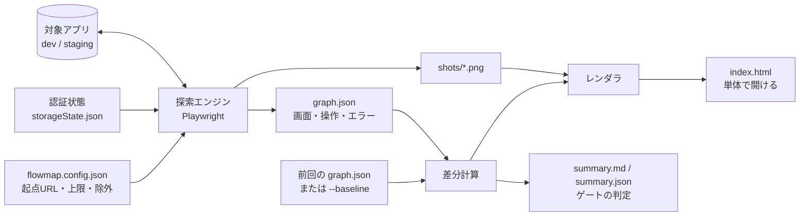
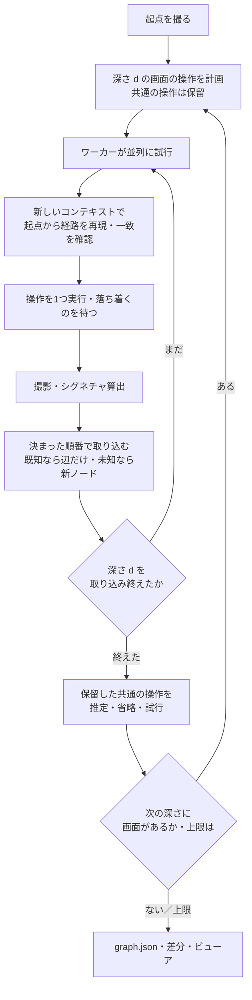
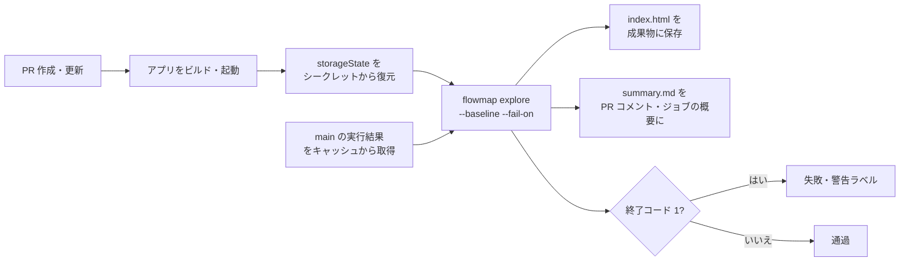

# flowmap 設計書

Sep 24, 2026 · @raku1chi

## 1. 目的と背景

flowmap は、SPA を自動探索して画面遷移をフローチャートとスクリーンショットで一望し、AI 駆動開発で追いつかなくなった動作確認を「見る」作業に変えるツールである。

開発速度が上がった一方、変更のたびに全画面を手で辿る確認が追いつかず、別の画面が壊れたことに後で気づく状況が起きている。Playwright でテストを書けば防げるが、爆速で変わるコードに対してキャプチャや期待値のコードを書き続けるコストが見合わない。

そこで「テストを書く」代わりに「アプリを渡すと勝手に全画面を辿って撮ってくる」道具を置く。かまいたちの夜のフローチャートのように、どの操作でどの画面に行き、そこで何が起きているかを見渡せる状態が目標である。ただし全画面を 1 枚の図に描くと画面数に応じて矢印が増えて読めなくなるため、全画面の木は索引に留め、読む単位は「グループ（画面のまとまり）とグループの間の関係」「1 本の操作フロー」に小さく切る。

| 観点 | Playwright Trace Viewer | flowmap |
| --- | --- | --- |
| 入力 | 人が書いたテストコード | URL（と認証状態） |
| 見え方 | 時系列の一本道 | 分岐図（同じ画面は合流） |
| 回帰検知 | アサーションを書いた箇所のみ | 前回実行との差分を全画面で自動表示 |
| 位置づけ | 単体テストの記録 | 目視確認の代替・地図 |

## 2. 対象範囲と前提

対象は自社で開発中の SPA（React／Vue 等）で、ローカル開発サーバーまたはテスト DB を向いたステージング環境に対して実行する。本番環境には向けない。

| 項目 | 内容 |
| --- | --- |
| 対象アプリ | ブラウザで動く Web アプリ。SPA 中心、サーバーレンダリングも可 |
| 実行環境 | Node.js 22 以上、Playwright（Chromium）。開発者 PC または CI |
| 実装言語 | TypeScript |
| 利用者 | 開発者本人。将来はレビュアー・非エンジニアが index.html を見るだけの利用も想定 |
| 入力 | 起点 URL、設定ファイル、（任意）認証状態ファイル |
| 出力 | graph.json、画面ごとの PNG、単体で開ける index.html |
| 対象外 | ネイティブアプリ、ホバー・ドラッグ・キー操作で出る UI、複数ユーザーの同時操作、本番データ |

前提として、探索中に押した操作は実際にサーバーへ届く。送信・登録系の操作は自動入力値で 1 パターンだけ実行するため、データが増えることを許容できる環境が必要である。

## 3. 全体構成

探索エンジン・グラフモデル・ビューアの 3 層に分け、間を graph.json で切る。ビューアは graph.json だけから描けるので、探索をやり直さずに見た目だけ直せる。



探索エンジンが対象アプリを辿って graph.json と PNG を出し、前回（または指定した比較対象）の graph.json と比べた差分を付けてレンダラが index.html を生成する。CI 向けに、件数とゲートの判定を summary.md / summary.json に書く。

| モジュール | 役割 | 主なファイル |
| --- | --- | --- |
| 設定 | 既定値、設定ファイル（コメント可の JSON）の読み込みと検証、CLI 引数による上書き | config.ts（型は types.ts） |
| 正規化 | URL のデータ区間、クエリの扱い、骨格とシグネチャの算出、同じ形の操作の畳み込み（§5）。ブラウザに依存しない純粋関数 | normalize.ts |
| ブラウザ内の処理 | 操作対象の列挙、範囲を絞った自動入力、DOM の変化の記録。page.evaluate と init script に渡す自己完結の関数 | inpage.ts |
| ワーカー | ブラウザコンテキストの作り直し、落ち着き待ち、操作の再特定とクリック、撮影、エラー収集 | session.ts |
| 探索エンジン | 深さごとの幅優先探索、決まった順番での取り込み、共通の操作の推定、データ区間の学習、graph.json の組み立て | explore.ts |
| 差分 | 比較対象の選択と差分計算（§10） | diff.ts |
| CI 向けの出力 | ゲートの判定、summary.md / summary.json（§10） | report.ts |
| マスク | 生成物に残す URL からトークンなどを伏せる（§6） | mask.ts |
| Jev 判定（任意・実験的） | 危険な操作の判定。画面の合流とデータ区間の確認は既定で使わない（§5） | jev.ts |
| レンダラ | graph.json からフローチャート HTML を生成 | render.ts |
| CLI | explore／render の 2 コマンド | cli.ts |

CLI は `flowmap explore --url <起点>` と `flowmap render <実行ディレクトリ>` の 2 つに絞る。終了コードは 0（成功）、1（`--fail-on` のゲートに掛かった）、2（使い方・設定の誤り）、3（探索できなかった）、130（中断）。

## 4. 探索エンジン

探索は深さごとの幅優先で、各画面の操作対象を 1 つずつ試し、着いた先が新しい画面なら次の深さに回す。次の操作を試すときは起点から経路を再現して元の画面に戻る。



### 起点からの再現と、状態を持ち越さないこと

起点から再現するのは、SPA では履歴の戻りが状態を正しく戻さないことが多いためである。再現は毎回、storageState だけを持った**新しいブラウザコンテキスト**で行う。同じコンテキストを使い回すと、前の試行で変わった localStorage・sessionStorage・Cookie・IndexedDB・メモリ上の状態が次の再現に持ち越され、起点を開き直しても同じ画面にならない。

実アプリ（localhost:8787、2026-09-26 の実行）ではこれが「同じ画面を何度も辿る」問題の主因だった。「重視する点」の設定が localStorage に残り、途中で押した設定が以後のすべての再現に効いて、トップ画面が 6 ノード、検索結果が 5 ノードに分かれ、経路の再現が 60 件失敗した。設定の値は開閉（summary）のラベルに出るので骨格も変わり、Jev も「表示の切り替えによる違い」とみなして合流させなかった（それ自体は正しい判定である）。画面の同定では直せないので、再現の側で状態を最初に戻す。デモアプリにも同じ仕掛け（ヘッダの「表示順」）を入れてあり、旧エンジンは 35 ノード・失敗 61 件・9 分半、今のエンジンは 18 ノード・失敗 0 件・約 1 分だった。

再現した画面は、シグネチャが元の画面と一致したかを確かめる。一致しなければ 1 回だけやり直し、それでも違えば、骨格のどの行が違うかをノードの `unstable` に残して先へ進む。開くたびにおすすめ枠が変わるような画面を見つけ、`volatileSelectors` で外すための手がかりにする。

「戻る」は近道としてだけ使う（`useBackNavigation`、既定 true）。リンクで遷移した操作のあと、ストレージと Cookie（HttpOnly を含む）が操作前と同じならブラウザの戻るを 1 回使い、戻った先のシグネチャとストレージが元と一致したときだけ次の操作にそのまま進む。ボタン・送信・状態を変えた操作のあとは必ず起点から再現する。操作が画面を変えなかったとき（シグネチャ・URL・ストレージが同じ）はその場に留まる。

### 並列と決定性

試行はワーカー（`workers`、既定 4）で並列に走らせるが、結果は「画面の順 → 操作の順」という決まった順番で 1 つずつ取り込む。新しいノードの id、発見辺、データ区間の学習、共通の操作の判定はこの取り込み順だけで決まるので、並列数やタイミングによらず同じ結果になる（E2E テストで、並列 4 と 2 のノード id・シグネチャ・辺が一致することを確かめている）。1 つのワーカーは同じ画面の操作を 4 件ずつまとめて試し、その中でだけ「戻る」の近道を使う。まとめ方は並列数によらず固定である。

深さ d の試行を全部取り込んでから深さ d+1 に進むので、発見辺の from は必ず深さ d のノードになる（ビューアの tidy tree の前提）。画面数上限に達したら、その時点で取り込みを止め、走っている試行を打ち切る。

サーバー側の状態（送信したお問い合わせ、サーバーに保存されるカートなど）は戻せない。並列にすると送信の順番が入れ替わりうるが、一覧の件数などは骨格では畳まれるので、ノードと辺は変わらない（本文のハッシュ、つまり「変化」には出うる）。

### 落ち着き待ち

操作やページの読み込みのあと、通信が途切れ（進行中のリクエストが 0 で、最後の通信から 250 ms）、DOM の変化が `quietMs`（既定 400 ms）止まるまで待つ。上限は `settleTimeoutMs`（既定 5 秒）で、操作の直後は変化がまだ始まっていないことがあるので最低 `quietMs` は待つ。`networkidle` は使わない。常時通信する画面では必ず上限まで待ち、通信の後に描画する画面では描画前に抜けるためである。

3 秒を超えて開いたままの通信（ロングポーリング）と EventSource・WebSocket は数えない。style 属性だけの変化（アニメーション）と、`volatileSelectors` の中の変化（時計など）は DOM の変化に数えない。上限まで落ち着かなかった画面は、骨格の指紋が 250 ms おきに 2 回続けて同じになるまで撮り直す（上限 `stabilizeMs`）。撮影は CSS アニメーションを止めて行い、コンテキストは prefers-reduced-motion にする。

### 操作対象の列挙

可視の `a[href]`、`button`、`role=button|tab|menuitem|link`、`input[type=submit|button|image]`、`summary`、`onclick` 付き要素を対象にし、開いている shadow root の中も辿る。可視とは、大きさがあり、`display:none`・`visibility:hidden`・`opacity:0`・`pointer-events:none` でなく、無効（disabled・aria-disabled・inert）でなく、ビューポート内なら中心点が他の要素（モーダルのオーバーレイ等）に覆われていないこと。ビューポート外の要素には重なり検査をしない（画面端の座標で代用すると開閉やスクロールのたびに結果が変わり、骨格が不安定になる）。ラベルは aria-label → aria-labelledby → innerText → value → title → img alt → svg title の優先順で決め、同じラベルが複数あれば出現順の番号で区別する。

除外は 3 種類で、ラベル文言（`denyText`）、セレクタ（`denySelectors`、既定 `[data-flowmap-ignore]`）、URL パターン（`denyUrlPatterns`）である。Cookie の同意バナーやチャットの窓のように操作を覆うものは `hideSelectors` で撮影と操作の前に非表示にする。

開閉・ポップアップの操作（summary、aria-expanded・aria-haspopup を持つ要素、combobox）には印を付ける。これらはラベルに今の値が出る（「表示順: 在庫あり優先 ▾」）ので、画面の同定ではラベルを見ない（§5）。

試す順番と件数は `maxActionsPerPattern` で整える。同じ形の操作（行き先の正規化ルートが同じリンク、同じラベルのボタン）は 1 画面につき 3 件までに絞り、形ごとに 1 件ずつ順繰りに並べてから `maxActionsPerState` で切る。一覧の同種リンクが先頭を占めて他の操作に予算が回らない事態を避けるためで、ZAP の Maximum children に相当する。

### 共通の操作（同じ画面を何度も辿らない）

ヘッダ・フッターのリンクや開閉は全画面にあるので、画面ごとに押すと試行の大半がそれで埋まり、開閉は画面ごとに「開いた状態」のノードを作る。共通の操作は次のように扱う。

- 操作を「キー」で束ねる。リンクは行き先の正規化ルート（`/items/*` など）、それ以外は役割とラベル（数字は潰す）。データを変えうる送信は対象にしない（検索フォームの送信は対象）。
- 同じキーの操作は、別々の画面から合わせて `maxLinkRepeats`（リンク、既定 3）／ `maxLocalActionRepeats`（それ以外、既定 2。開閉は 1）回まで試す。それを超える画面では保留し、その深さの試行を取り込んだあとで決める。
  - 毎回同じ画面に着いたリンク → 押さずに辺を推定する（`inferred: true`）
  - 毎回その場の変化（変化なし、同じルートの中の開閉・モーダル）だけだった操作 → 省く
  - 結果がばらついた・失敗した → 押す
- 推定と省略は「きれいな」画面でだけ行う。起点からリンク・タブ・開閉・検索だけで来て、途中でストレージが変わらなかった画面のことで、ボタンや送信を経た画面ではカートの中身などが違いうるので、共通の操作も押す。
- 保留した操作は操作数の上限（`maxActionsPerState`）に数えない。

ビューアは推定した辺も含めて共通ナビとして畳む（§8）。推定した辺は右パネルで「推定」と表示する。

### 操作の実行

1. 列挙と同じ規則で対象要素を見つけ直し、印を付ける。見つけ直しは role・ラベル・出現順で行い、見つからなければ data-testid などの識別子、ラベルの数字（件数・ページ番号。桁区切りを含む）を潰した一致、同じ役割の開閉が 1 つだけならそれ、データ区間のリンク（企業名など）が一覧から消えていれば行き先が同じ形の別のリンク、の順に探す。印を付けるときに role とラベルが変わっていないかを確かめ、描き変わっていたら探し直す
2. 送信系の操作（submit と、フォーム外のボタン）のときだけ、そのフォーム（フォームが無ければ近い祖先の入力欄）を設定値で自動入力する。既に値があるものは触らない。select は未選択（値が空）のときだけ最初の有効な選択肢を選ぶ。required のチェックボックスとラジオは入れる。別のフォームや、押していない検索欄は埋めない（埋めると入力候補が開いて画面が変わり、他の操作を覆う。実アプリで起きた）
3. 別タブで開くリンク・フォーム（target=_blank）は同じタブで開かせる（別タブは閉じるので、行き先を撮れなくなるため）
4. クリックする（`actionTimeoutMs`、既定 5 秒）。失敗したら Playwright の理由（覆われている・無効・見えない）を添えて記録する
5. 落ち着くのを待つ。別タブが開いたら閉じ、ダイアログは受け入れ（`dialogs: dismiss` で断る）、ダウンロードは拒否する

### 収集する情報

画面ごとに、URL、タイトル、スクリーンショット、本文テキストのハッシュ（volatile の中は除く）、開いているダイアログと開閉、コンソールエラー（`console.error`・`pageerror`）、失敗したリクエスト（接続失敗と 4xx／5xx 応答。画面遷移で打ち切られただけのもの（ERR_ABORTED）は除く）を記録する。既知の画面に再訪した場合もエラーは追記する。開けなかった外部サイトはブラウザのエラーページではなく、行き先の URL で記録する。

### 上限と停止条件

| 条件 | 既定 | 到達時の扱い |
| --- | --- | --- |
| 画面数 | 60 | 探索を停止し、理由を graph.json に記録。毎回同じところで止まるので、前回比の対象にしてよい |
| クリックの深さ | 6 | その画面の先は辿らず「深さ上限」として表示 |
| 1 画面あたりの操作数 | 25 | 超過分は試さず「n 件中 m 件を試行・推定」と表示 |
| 時間 | なし（`maxDurationMinutes`） | そこまでの結果を書き出して止める |
| 起点に接続できない | 5 回続けて | 止める（アプリが落ちた） |
| 認証切れ | `loginUrlPattern` に 3 回続けて着いた | 止める。起点がログイン画面に移ったら探索を始めない |
| 中断（Ctrl-C） | — | そこまでの結果を書き出す。2 回目の Ctrl-C で即座に終わる |
| 対象外オリジン | — | 外部サイトは撮影のみ、操作は列挙しない（`followExternalLinks: false` で押さない） |

深さ 1 段ごとに graph.json を途中経過として書き出すので、途中でプロセスが落ちても `pnpm render` でそこまでの結果を見られる。途中で止まった実行（中断・時間切れ・エラー）は、次の実行の比較対象に選ばない。

## 5. 画面の同定（シグネチャ）

「同じ画面か」は URL と画面の骨格から作るシグネチャで判定し、`/items/12` と `/items/34` のような ID 違いを 1 ノードに合流させる。この判定が甘いとノードが無限に増え、厳しいと別画面がまとめられるので、設計の要である。シグネチャは決定的な関数で、外部の判定（Jev など）に依存させない。実行間の比較（§10）がこの値の一致に依っているためである。

```latex
\mathrm{signature} = \mathrm{sha1}\bigl(\mathrm{normalize}(\mathrm{path}) \;\Vert\; \mathrm{structure}\bigr)
```

| 要素 | 内容 | 正規化 |
| --- | --- | --- |
| path | pathname（デコード済み）。ハッシュルーティング（`#/users/1`）ならハッシュもパスとして扱う | ID に見える区間（数字だけ、UUID、数字と英字の混じった 8 文字以上）と「データ区間」（後述）を `*` に置換。それ以外の数字は `#` |
| query | クエリ文字列 | 既定は見ない（`queryParams: ignore`）。ページ送り・絞り込み・並び替え・検索語で画面を分けないため。`structuralParams` に挙げた名前は値を残し、`dataParams` に挙げた名前はデータとして `*` にする |
| structure | 開いているダイアログ、選ばれているタブ、可視の見出し（h1〜h3）、操作対象、フォーム項目の type・name | 数字を `#` に置換。操作対象はリンクなら行き先の正規化ルート（別オリジンはホスト名だけ）、それ以外はラベルで表し、**同じ形のものは 1 つに畳んで並べ替える**（DOM の出現順に依存させない）。今の画面と同じルートへのリンク（ページ送り・絞り込み・ページ内リンク）は入れない。開閉のラベルは見ない。`volatileSelectors` の中の要素は入れない。見出しとラベルからはデータの値を消す |
| 外部サイト | ホストと、ID を潰したパス | 撮影のみ、structure は使わない |

開閉のラベルを見ないのは、ラベルに今の値が出るからである（「重視する点: 均等」「表示順: 在庫あり優先」）。値が変わっても同じ画面であり、開いたかどうかは中身の操作が増えることで骨格に出る。ダイアログとタブは骨格に名前で入れるので、モーダルとタブ違いは別ノードになる（意図どおり）。

### データ区間

`/companies/サービス業` と `/companies/小売業` のように、同じテンプレートに違うデータを流し込んだ画面を 1 ノードに合流させるため、URL パスの「データを表す区間」を `*` に置き換える。ZAP の Data Driven Content と同じ発想で、決め方は 3 つある。実装は `src/normalize.ts`。

1. **ID に見える区間は常にデータ。** 数字だけ、UUID、数字と英字の混じった 8 文字以上（書類番号・ハッシュなど）。`/company/6010601048836` は最初から `/company/*` になる。
2. **設定で宣言する。** `pathRules` に正規表現と置換を書く（`^/companies/[^/]+` → `/companies/*`）。クエリの値がデータなら `dataParams` に名前を書く（`/item?id=12` → `/item?id=*`）。
3. **自動で学習する。** 1 つの画面に「1 区間だけ違う同じ形の href」が `autoPathRulesMinSiblings`（既定 3）本以上並んでいれば、その区間をデータとみなす。先頭区間（`/about` `/contact` のようなトップレベルの経路）は対象にしない。ナビゲーション（nav・header など）の中に並ぶ、数字を含まない語だけの 12 本以下のリンク（`/settings/profile` `/settings/security`）は別々の画面のことが多いので候補にしない。学習した区間は graph.json の `meta.learnedPathRules` に残るので、`pathRules` に書き写せば次回から明示的になる。

データ区間を持つ画面では、h1 はレコードの名前（企業名・商品名）であることが多く URL からは消せないので、骨格に h1 の文言を入れず「h1 がある」ことだけを残し、その文言を他の見出しとラベルからも消す（「ＡＩＡＩグループ株式会社を比較に追加」→「*を比較に追加」）。h2 以下は残すので、同じ詳細画面のタブや節の違いは区別できる。データ区間の値（`サービス業`）も見出しやラベルから消すので、「サービス業の企業一覧」と「小売業の企業一覧」は同じ骨格になる。合流したノードには最初に到達した URL 以外を `mergedUrls` として記録し、ビューアで「何が畳まれたか」を見せる。

自動学習は探索の途中で起きるので、学習したら既存のノードのシグネチャを新しい正規化で計算し直す。学習前に撮った画面（`/companies/サービス業`）と学習後の画面が同じシグネチャになれば、深さが同じなら合流させる（発見辺の木が崩れない）。深さが違えば両方残し、後のほうのシグネチャに `~2` を付けて区別する。取り込み順が決まっているので、同じアプリを同じ設定で回せば学習の順序も結果も同じになる。

シグネチャとは別に、本文テキストのハッシュ（textHash）を持つ。シグネチャが同じで textHash が違う画面は、次回実行との比較で「変化」として扱う。

既知の問題と対処方針は次のとおり。

| 問題 | 症状 | 対処 |
| --- | --- | --- |
| 表示設定・入力途中の値 | 設定の値が開閉のラベルに出る、押していない検索欄を埋めて候補が開く | 開閉のラベルは骨格に入れない。自動入力は押すフォームだけ。再現は毎回まっさらなコンテキストで行う（§4） |
| モーダル・トースト | 出ている間だけ骨格が変わり別画面扱いになる | 想定どおり別ノードにする（モーダルも見たい画面）。トーストは落ち着き待ちで消える |
| 一覧の件数差・ページ送り | 行ごとのリンクの数やページ番号で骨格が変わる | 同じ形の操作対象は 1 つに畳み、同じルートへのリンクは骨格に入れないので、件数やページが違っても骨格は同じ |
| タブ切替 | URL 不変で内容だけ変わる | 選ばれているタブを骨格に入れるので別ノードになる。意図どおり |
| ランダムな ID や slug を含む href | 語の値は潰れない | ID に見える区間は常に潰れる。語は同じ形のリンクが 3 本以上並べば自動学習で潰れる。単独なら `pathRules` で宣言する |
| 兄弟ページの誤合流 | `/settings/profile` `/settings/security` のような別画面が同じ区間として学習される | ナビゲーションの中の語だけのリンクは学習しない。学習しても骨格（見出し・フォーム項目）が違えば別ノードのまま |
| データで骨格が変わる詳細画面 | 開示項目の有無などで同じテンプレートの画面が数種類に分かれる | 変種ごとにノードが分かれる（誤った合流よりは安全側）。ビューアは同じルートを枠でまとめて示す。共通の操作は推定されるので、変種ごとの試行は少ない |
| 開くたびに変わる部分 | おすすめ枠・時計・最近見たもので骨格や本文が変わる | `volatileSelectors`（既定 `[data-flowmap-volatile]`）で画面の同定と本文の比較から外す。再現が一致しない画面は `unstable` として問題一覧に出る |

### Jev による判定（任意・実験的）

[Jev](https://docs.typesafe.ai/introduction)（TypeSafe の型付き判定モデル）による判定を任意で足せる。実装は `src/jev.ts`、問いと閾値の根拠は `experiments/jev/README.md` の試験結果。既定は無効で、`jev.enabled` か `--jev` で有効にする。

**判断（2026-09-26）: 画面の同定（合流・データ区間）には使わない。危険な操作の判定だけを、初めて探索するアプリで任意に使う補助として残す。CI では使わない。**

- **当初の課題は Jev の領域ではなかった。** 「同じ画面を何度も辿る」の主因は、起点からの再現に前の試行の状態（localStorage の設定）が持ち越されることと、押していないフォームを自動入力して画面が変わることだった（§4）。どちらも探索エンジンの側で決定的に直せる。8787 の実行でも、Jev は 12 の状態を合流させたが、この重複は「表示の切り替え」とみなして合流させず（正しい判定）、25 ノードが残った。
- **同定は決定的でなければならない。** Jev の値は同じ入力でも実行ごとに最大 0.07 揺れる。キャッシュ（`outDir/jev-cache.json`）で同じ答えを返すが、キャッシュを引き継がない CI では合流のしかたが変わり、「消失＋追加」が誤って出る。合流は代表との比較なので、発見順にも依存する。
- **一覧の変種は決定的なルールで合流できるようになった。** 8787 で Jev が合流させた多くは、ページ送り・五十音の絞り込み・ランキングの軸（いずれもクエリ）の違いだった。クエリを既定で見ないことと、同じルートへのリンクを骨格に入れないことで、Jev なしで合流する。残るのは開示項目の有無で節が変わる詳細画面の変種で、これはノードが数個に分かれるだけで探索は破綻しない。
- **外部送信と運用の負担。** 画面の要約（タイトル・見出し・ラベル・URL のパス）を社外の API に送るので、社外に出せない内容のアプリでは使えない。API キー、ネットワーク、障害、閾値の測り直し（試験は 2 アプリ・93 ケース）の負担もある。
- **危険な操作の判定には価値が残る。** `denyText` に無い業務の動詞（「出荷する」「承認する」「送金する」）を、設定なしで止められる（試験で 17 件すべて）。一方でフォームの送信や保存も押さなくなるので、地図の網羅は減る。初めて探索するアプリで安全を優先するときに使い、止めた操作（ビューアの「Jev が危険と判定して押さなかった操作」）を見て `denyText` に書き写すのがよい。書き写したあとは Jev なしで決定的に止まる。

`--jev` を付けると、既定では危険な操作の判定だけを行う（`jev.actions`）。画面の合流（`jev.pages`）とデータ区間の確認（`jev.dataSegments`）は既定で無効で、使うなら設定で明示的に有効にする。その場合も合流させた状態は `aliasSignatures` に残して実行間の比較に使い、比較対象と Jev の有無が違えば差分に注意書きを付けてゲートで消失を数えない（§10）。キャッシュが無い状態で前回比較をするときは警告を出す。

判定の作りは次のとおり。

| 判定 | いつ聞くか | 問い（Noul） | 使い方 |
| --- | --- | --- | --- |
| 操作（既定で有効） | 新しい画面の試す操作を決めたとき | その操作はサーバーのデータを作る・変える・消す、または誰かに何かを送るか | 日英の問いのどちらかが `actionThreshold`（0.5）以上なら押さない。リンクは 0.7 以上のときだけ。タブと開閉は聞かない |
| 画面（既定で無効） | 未知のシグネチャの画面を撮ったとき | 種類と目的が同じ画面か／違いは UI 操作による表示の切り替えか | 同じ区画（先頭のパス区間が同じ）の既存ノード最大 8 件と比べ、min(種類が同じ, 1 − UI 操作) が `mergeThreshold`（0.7）以上なら合流 |
| データ区間（既定で無効） | 機械的ルールが候補を見つけたとき | 兄弟リンクはどれも同じ作りの画面を別データについて開くか | 日英の問いがともに `mergeThreshold` 以上なら学習、そうでなければ見送る |

- **コードで決められることは聞かない。** 違いのない 2 画面は Jev に聞かず同じ画面とする。タブと開閉は表示を切り替えるだけなので、操作の判定に回さない（「危険な操作」という名前のタブを危険と判定したため）。
- **要素の性質を閾値に入れる。** リンクは GET の遷移で、HTTP の約束ではデータを変えない。ヘッダの「お問い合わせ」リンクを 0.5 前後で危険と判定したため、リンクは 0.7 以上のときだけ止める。
- **0.5 付近で決めない。** 合流は画面を見落とす側の誤りなので 0.7 以上に限り、操作は押してしまう側の誤りなので 0.5 以上で止める。
- **答えはキャッシュする。** `(モデル, 問い, state)` のハッシュで `outDir/jev-cache.json` に保存し、同じ画面には同じ答えを返す。
- **失敗したら機械的ルールで進める。** 問い合わせに失敗した判定はその場で機械的ルールに任せ、回数を `meta.jev.errors` に残す。キーが無い・通らないときは探索を始めずに止める。

採用し直す条件は、判定を探索の中で使うのではなく「設定の提案」（`denyText`・`pathRules` の候補）に変えて人がレビューし、決定的な設定に落とす形にできること、または合流の判定を実行間で固定できること（キャッシュの共有）とする。

## 6. 認証・セッションの扱い

認証は探索エンジンの外で済ませ、ログイン済みのブラウザ状態（Playwright の storageState）を渡して探索する。ツール自身にログイン手順を持たせないことで、ID・パスワードを設定ファイルに書かずに済み、SSO・二要素・reCAPTCHA など自動化しにくい認証にも同じ方法で対応できる。

### 方式の比較

| 方式 | 手順 | 向く場面 | 難点 |
| --- | --- | --- | --- |
| storageState 再利用（採用） | `npx playwright codegen --save-storage=auth.json <URL>` で一度手でログインし、`--storage auth.json` で渡す | 通常のログイン、SSO、二要素あり | セッション期限が切れると再取得が要る |
| セットアップスクリプト | `auth.setup.ts` にログイン操作を書き、探索前に自動実行して storageState を作る | CI で毎回無人実行したい | パスワードを環境変数で渡す必要。認証 UI が変わると壊れる |
| 認証をバイパスするテスト用入口 | 開発環境だけ有効なテストログイン API や固定トークンをアプリ側に用意する | 自社アプリ、CI 常用 | アプリ側の対応が要る。本番に混入させない仕組みが必須 |
| ヘッダ・Cookie の直接注入 | `extraHTTPHeaders` や `context.addCookies` でトークンを渡す | API キー型、Basic 認証 | トークンの取得元が別に要る |

### 探索中の考慮点

- **ログアウト操作を押さない**: `denyText` と `denyUrlPatterns` で除外する。押すと以後の全操作がログイン画面に落ちる
- **セッション切れの検知**: 設定 `loginUrlPattern`（ログイン画面の URL の正規表現）を書くと、探索中にログイン画面へ 3 回続けて移ったら「認証切れ」として探索を止め、理由を graph.json に残す（ログイン画面へのリンクを押した場合は数えない）。起点そのものがログイン画面に移ったら探索を始めない。storageState を渡したのに起点にパスワード入力欄があれば警告する
- **起点から再現する方式との相性**: 再現のたびに storageState だけを持った新しいコンテキストを作るので、ログイン状態（Cookie・localStorage）は毎回 storageState の時点に戻る。ログイン操作は要らず、探索中に変わったセッションの状態も持ち越さない。サーバー側でセッションが失効すれば全試行がログイン画面に落ちるので、上の検知で止まる
- **ロール別の探索**: 管理者・一般ユーザーなど権限で見える画面が違う場合、storageState を分けて別々に実行し、実行ディレクトリ名にロールを含める。同一ロール内でのみ差分を取る
- **CSRF・ワンタイムトークン**: ページ内に埋め込まれたトークンはそのページのフォームで使うので問題ない。ページ再取得のたびに変わるトークンは、起点から再現する方式のおかげで常に最新の値になる

### 認証情報の取り扱い

storageState ファイルは Cookie とトークンを平文で含むので、`.gitignore` に入れ、CI では暗号化シークレットとして渡す。生成した index.html と graph.json には認証情報を含めない。storageState の中身は書き出さず、URL（画面の URL、合流した URL、辺の href、エラーメッセージ中の URL）は `maskUrlParams`（既定で `*token*`・`code`・`state`・`session*`・`*secret*`・`*password*`・`x-amz-*` など）に当たるクエリとハッシュの値、userinfo のパスワードを `***` に伏せてから書き出す。

### 認証が必要な画面が起点の場合

起点そのものがログイン画面に飛ばされるアプリでは、storageState なしの実行で「ログイン画面 → 入力 → 送信」の 1 経路だけが探索される。フォームの自動入力値（`fill.email`／`fill.password`）にテストアカウントを入れれば探索エンジンがログインして先へ進めるが、パスワードが設定ファイルに残るため、この方法は推奨しない。storageState 方式を基本とする。

## 7. 安全設計

探索は本物のクリックと送信を行うので、壊してよい環境に対してだけ動くよう、ツール側と運用側の両方で歯止めをかける。

| 層 | 対策 | 既定 |
| --- | --- | --- |
| 操作の除外 | 削除・退会・ログアウト・支払い系の文言を含む操作は押さない | `denyText`: ログアウト、削除、退会、logout, sign out, delete |
| 要素の除外 | 開発者が `data-flowmap-ignore` 属性を付けた要素は押さない | 有効 |
| 意味による除外（任意・実験的） | Jev が「サーバーのデータを変える」と判定した操作は押さない（§5）。フォームの送信や保存も押さなくなる | 無効（`jev.enabled`） |
| URL の除外 | `/logout`、`mailto:`、`tel:` へは遷移しない | 有効 |
| オリジン制限 | 起点と別オリジンは撮影のみ、操作しない | 有効 |
| 送信の抑制 | `allowSubmit: false` で submit 種別の操作を全て除外できる | true |
| 入力の範囲 | 自動入力は押す送信ボタンのフォームだけ。他のフォームや検索欄は埋めない | 有効 |
| 環境の確認 | 起点 URL が localhost・127.0.0.1・`*.local`・`allowedHosts` 以外なら、`--yes` が無ければ実行しない | 有効 |
| 状態の隔離 | 再現のたびに新しいコンテキストを作る。前の試行で押した設定や入力が次の試行に効かない | 有効 |
| 上限 | 画面数・深さ・操作数・時間・タイムアウトで暴走を止める | 60／6／25／なし／5 秒 |

除外文言は日本語と英語の両方を既定に含める（ログアウト・削除・退会・logout・sign out・log out・delete・サインアウト・解約）。アプリ固有の危険な操作（「承認」「出荷」「送金」など）は利用者が設定に足す。README にこの点を明記している。初めて探索するアプリでは Jev の操作判定で候補を洗い出し、`denyText` に書き写す使い方ができる（§5）。

Jev を有効にすると、判定のために画面の要約を typesafe.ai の API に送る。送るのは画面のタイトル・見出し・操作のラベル・フォーム項目の種類と名前・URL のパスとクエリで、クエリのうち token・key・session・auth・code・email などを含む名前の値は `***` に伏せる。認証情報（storageState・Cookie）、スクリーンショット、本文は送らない。社外に出せない内容を表示するアプリでは有効にしない。API キーは環境変数 `TYPESAFE_API_KEY` か `.env` から読み、`flowmap.config.json` には書かない。

探索中のブラウザはヘッドレスで、ダウンロードは拒否、別タブは即閉じ、Service Worker は止め（`serviceWorkers`）、`alert`／`confirm` は受け入れる。`confirm` を受け入れる挙動は削除系と相性が悪いため、`dialogs: "dismiss"` で断るか、除外文言に頼らず `allowSubmit` と組み合わせて使うことを推奨する。

## 8. ビューア

ビューアは外部ライブラリなしの単体 HTML で、graph.json を埋め込んで生成する。ファイルを開くだけで動き、CI の成果物としてそのまま共有できる。

### 画面構成

ビューアは「グループ図（グループの関係図）」「グループ（部分木）」「フロー（コマ割り）」「全画面の木」「問題一覧」の表示を持つ。上位の 3 つ（グループ図・全画面の木・問題一覧）はヘッダの切替で並び、グループとフローはそこから中に入る形で、パンくず（出発点 › グループ › フロー）と Esc で戻る。着地は画面数で決め、40 画面以下ならコンパクトな全画面の木、それより多ければグループ図にする。木はサムネイルを消すと構造が読めるため、グループの中も全画面の木も既定でサムネイルなし（ヘッダの「サムネイルを表示」で出す）。右パネルは表示に応じて概要・グループの情報・画面の詳細を出す。表示の切り替え（グループ・フロー・コマ・画面の選択）は URL のハッシュに載せて history に積み、ブラウザの戻る／進むと直リンクを効かせる（`#g=<グループ>&s=<画面>`、`#f=<フロー>&k=<コマ>`、`#map`）。ハッシュを使うのは file:// で開いても動かすためである。

```
グループ図                                              グループ（設定）
┌──────┐        ┌────────────┐                     ┌────┐ ─設定─▶ ┌────┐ ─〈通知設定〉─▶ ┌────┐
│ 起点 │─商品一覧─▶│ 商品一覧 2画面 │ …               │起点│         │一般│ ─〈危険な操作〉▶ ┌────┐
│      │─設定────▶│ 設定 4画面   │                   └────┘         └────┘ ─[保存する]─▶ ┌────┐
└──────┘    ◀‥トップへ‥│ お問い合わせ │                                 └ → 商品一覧のグループへ（札）
フロー（「送信する」を押す → 送信完了）
┌────┐ ─「お問い合わせ」を開く─▶ ┌────┐ ─「送信する」を押す─▶ ┌────┐
│ 1  │                          │ 2  │                       │ 3  │
└────┘                          └────┘                       └────┘
```

| 表示 | 内容 |
| --- | --- |
| ヘッダ | 起点 URL、画面数・グループ数・フロー数・エラー画面数、前回比（追加／消失／変化／新エラー）、所要時間、停止理由、絞り込みボタン。2 段目に表示の切替（グループ図・全画面の木・問題一覧）、パンくず、検索、共通ナビ表示の切替、サムネイル表示の切替、表示倍率、使い方、凡例 |
| グループ図 | グループの関係図。左に起点、右の列にグループのカード（代表画面のサムネイル、画面数、フロー数、含まれる URL、エラー・新規・変化・外部のバッジ）。辺はグループをまたぐ操作をまとめたもので、起点からの入口は太いカギ線、グループからグループへの操作は細線または点線、共通ナビは既定で非表示。右パネルは探索の概要と操作フロー一覧、新エラー・消失・新規・変化の画面 |
| グループ | 起点＋そのグループの部分木を tidy tree で描く。木の枝はカギ線で太く、ラベルは子のすぐ左。他のグループへ渡る操作（共通ナビ以外）は画面の下に「→ グループ名」の札として出し、押すとそのグループへ移動して行き先の画面を選ぶ。右パネルはグループのフロー、エラー画面、他のグループとの出入り。画面を選ぶと詳細 |
| フロー | 木の葉ごとの「起点からそこまでの経路」を 1 本のフローとみなし、最後の操作を動詞形にした名前（「送信する」を押す → 送信完了）で一覧にする。最後の操作がデータのリンク（企業名など）なら行き先の画面名で呼ぶ（「〇〇の働きやすさデータ」を開く）。開くとキャンバスが横一列のコマ割りに変わり、コマ（番号・キャプチャ・画面名・エラー）の間に操作の矢印が入る。← → キーとクリックでコマを進め、右パネルにそのコマの画面の詳細を出す |
| 全画面の木 | 全画面を 1 枚にした木。サムネイルなしが既定で、40 画面以下ならここに着地する。それ以上でも索引として使える |
| 問題一覧 | コンソールエラー・失敗リクエスト・失敗した操作・前回との差分（消失・変化・新規）・探索の打ち切りを画面ごとにまとめた表。深刻度と「前回になかったか」で並べ、種類の絞り込みと「前回になかったものだけ」の切替を持つ。行から画面の詳細とグループ内の位置へ飛べる。ヘッダの「問題一覧 (n)」と、エラー・消失・変化の数字から開く |
| 画面の詳細（右パネル） | 起点からの経路のパンくず、拡大キャプチャ（変化画面は前回と並べる）、グループ・深さ・見出し・ダイアログ・開いている開閉・シグネチャ、できる操作と行き先（他のグループならグループ名を添え、押さずに推定した辺には「推定」と付ける）、ここへ来る操作、この画面を通るフロー、コンソールエラー、失敗リクエスト。再現が一致しなかった画面は注意を出す |

### グループの決め方

起点から直接行ける画面（探索の木で起点の子）ごとに、その部分木を 1 つのグループとする。起点と同じ URL の状態（起点上のモーダルなど）は起点のグループに含める。グループをまたぐ辺のうち共通ナビ（ほぼ全画面から同じ行き先へ向かう操作）は関係図にも札にも出さず、別枠に一覧する。共通ナビを除外しないとグループの関係が完全グラフになり、全画面の木と同じ問題が再現するためである。

グループの所属は幅優先探索の発見順に従う。複数のセクションから辿れる画面は、起点ページで先に列挙されたリンクのグループに入るため、ヘッダのリンク順が変わると画面の所属グループが移ることがある。実アプリで所属が安定しない場合は、URL のパス（数字を正規化）でグループを切る方式に切り替える。

### 画面名

画面名はページのタイトルから作るが、`/company/1234` のような同じテンプレートの画面は、タイトルに企業名や商品名が入っている。これをそのまま使うと、たまたま最初に撮った 1 件の名前で画面全体を呼ぶことになるので、データの部分を「〇〇」に置き換えたテンプレート名（「〇〇の働きやすさデータ」）で表示する。撮影した実例は「例: ＡＩＡＩグループ株式会社 ほか 3 件」としてカードと右パネルに添える。表示だけの処理で、シグネチャや実行間の比較には関わらない。

| データとみなす値 | 例 |
| --- | --- |
| URL のデータ区間（`*`）の値と、名前だけ残したクエリの値 | `/companies/サービス業` の「サービス業」、`/search?q=flowmap` の「flowmap」 |
| データを表す見出し | 企業詳細の h1「ＡＩＡＩグループ株式会社」 |
| 実例どうしで違うタイトルの部分（代表のタイトルに上の値が見つからないときだけ） | 商品詳細の「ノートPC」「キーボード」 |
| 別の画面でデータと分かった値 | 比較画面のタイトルに入る企業名（URL は法人番号なので、企業詳細で分かった企業名で消す） |

- **見出しがデータか**は、実例が 2 つ以上あれば実例どうしで違うかで決める。実例が 1 つなら、データ区間を持つ画面の先頭の見出しをデータとみなす（シグネチャでも h1 をデータとして扱う）。ただし見出しに URL の値が入っていれば（「サービス業の企業一覧」）、URL の値がデータで残りはテンプレートの文言とみなす。
- **実例**は、探索が同じルートで合流させた別の URL のタイトルと先頭の見出しを `samples` に最大 20 件残す。古い graph.json には無いので、そのときは URL と見出しだけで判定する。
- **名前は代表（撮影した実例）のタイトルから作る。** 実例どうしの比較は、代表のタイトルにデータが見つからないときだけ使う。実例ごとにタイトルの形が違うアプリ（開示項目の多い企業だけ「〇〇の平均年収・…」になる）で、共通部分が「〇〇の〇〇」に痩せるのを避けるためで、名前がキャプチャと食い違わない利点もある。
- **置き換えるとサイト名しか残らない**とき（商品名だけのタイトル）は、データでない見出し（「商品詳細」）を名前にする。サイト名は、全画面のタイトルの過半に共通する末尾（「 — nagaku」）とする。
- **辺のラベルとフロー名もそろえる。** 行き先の実例のデータ（企業名）を文言に含むリンクは「〇〇」にし、同じ画面から同じ行き先への「〇〇」は 1 本にまとめて本数を添える。件数やページ番号のような数字は置き換えない。最後の操作がデータのリンクになるフローは、行き先の画面名で「『〇〇の働きやすさデータ』を開く」と呼ぶ。
- **置き換えるのは 2 文字以上で、数字と記号だけではない値**に限る（「2」や「あ」で無関係な文字を消さないため）。比べるときは全角半角と空白の違いを吸収し、残す部分は元の文字のままにする。
- 自動の名前が読みにくいときは、設定 `screenNames` でルートごとに名前を直接指定できる（`{ "/company/*": "企業詳細" }`）。表示だけの設定なので graph.json には入れず、`pnpm render` のときに今の設定ファイルから読む。
- **同じ名前の画面は副題で見分ける。** 手がかりは、開いているダイアログ（「保存しました」を表示中）、開いている開閉（「表示順: 標準」を開いた状態）、他の同名の画面に無い見出し（タブ名など）の順に使う。

### ノードのバッジ

| バッジ | 条件 |
| --- | --- |
| 起点 | root ノード |
| 新規 | 前回実行に同じシグネチャがない |
| 変化 | シグネチャは同じで textHash が違う |
| エラー n | コンソールエラー＋失敗リクエストの件数 |
| … | 深さ上限・操作数上限・外部サイトで探索を打ち切った |

### レイアウト

各画面に最初に到達した辺（発見辺）を木とみなし、tidy tree で配置する。列は深さ、行は木の葉の順で、親は子の中央に置く。発見辺は親から短い幹を出して子の高さまで下ろすカギ線で太く描き、ラベルは子のすぐ左に常時表示する。それ以外の進む辺は細い曲線、戻る辺は点線で、ラベルは選択・ホバー時のみ出す。ノードは 300×262 px でスクリーンショット全体（16:10）が切れずに入る大きさとし（コンパクト表示ではサムネイルなしの 70 px）、列間 170 px、行間 44 px の固定値で、キャンバスはスクロールとズームができる。章カードは 340×296 px、コマ割りのコマは 520 px 幅、右パネルは 460 px。コンパクト表示（サムネイルなし）が既定で、ヘッダの「サムネイルを表示」で切り替える。同じ URL（数字を正規化）の画面が列内で連続していれば枠でまとめて「/path · n 状態」と示す。画面を選ぶと起点からの経路（木の枝）を強調し、右パネルにパンくずで表示する。ノード数が 100 を超える場合の折りたたみ表示は拡張候補のまま。

### 見た目

夜の紺を背景に、ノードの白いサムネイルが浮かぶ配色とする。強調色は新規＝琥珀、変化＝緑、エラー＝赤、選択＝青の 4 色に限定し、装飾はドット地の背景のみ。キーボード（Tab／Enter）でノードを選べ、`prefers-reduced-motion` を尊重する。

## 9. データ形式

1 回の実行は `flowmap-out/runs/<ISO日時>/` に閉じ、graph.json・shots/・index.html と CI 向けの summary.md・summary.json を置く。graph.json があれば index.html は何度でも再生成できる。

```
flowmap-out/
├── jev-cache.json                 Jev を使ったときの答えのキャッシュ（任意）
└── runs/
    ├── 2026-09-23T09-00-00-000Z/
    │   ├── graph.json
    │   ├── shots/s001.png …
    │   ├── index.html
    │   ├── summary.md             PR コメントにそのまま貼れる要約
    │   └── summary.json           件数とゲートの判定
    └── 2026-09-24T10-00-00-000Z/   ← 最新。前回と比較した diff を含む
```

### graph.json

| キー | 型 | 内容 |
| --- | --- | --- |
| meta.schemaVersion | number | graph.json の形の版（今は 2）。無ければ版 1 |
| meta.signatureVersion | number | シグネチャの計算方法の版（今は 2）。前回と違えば差分に注意書きを付ける |
| meta.tool | string | 生成したツールと版 |
| meta.baseUrl | string | 起点 URL |
| meta.startedAt / finishedAt | ISO 日時 | 実行時刻 |
| meta.totalStates / totalEdges | number | 画面数・操作数 |
| meta.stoppedBecause / stopKind | string? | 途中で止めた理由と種類（maxStates・maxDuration・interrupted・error・auth・unreachable）。maxStates 以外は比較対象に選ばない |
| meta.learnedPathRules\[\] | string? | 探索中に学習したデータ区間（`/companies/*` の形）。`pathRules` に書き写せば明示的になる |
| meta.stats | object? | 試行・再現・「戻る」で復帰・推定した辺・省いた共通操作・再現の不一致の回数、並列数、所要ミリ秒 |
| meta.config | object? | 比較の前提になる設定の抜粋（上限・並列数・クエリの扱い・データ区間の設定など。認証情報やパスは含めない） |
| meta.jev | object? | Jev を使ったときの集計（モデル、問い合わせ・キャッシュ・失敗の回数、押さなかった操作と合流の数、見送ったデータ区間） |
| root | string | 起点ノードの id |
| nodes\[\] | StateNode | 画面 |
| edges\[\] | Edge | 操作（辺） |
| diff | Diff? | 前回実行との差分。比較対象が無ければなし |

### StateNode

| キー | 型 | 内容 |
| --- | --- | --- |
| id | string | `s001` 形式の連番（取り込み順）。学習で合流させたノードの番号は欠番になる |
| signature | string | 画面同定用ハッシュ（sha1 先頭 12 桁）。学習で同じになったが深さが違うため残したノードは `~2` などが付く |
| url / title | string | 到達時の URL とタイトル（URL の機微なクエリ値は伏せる） |
| route | string? | シグネチャに使った正規化済みのパス（データ区間は `*`）。外部サイトにはない |
| depth | number | 起点からのクリック回数 |
| screenshot | string | `shots/s001.png` の相対パス。撮れなかったときは空 |
| textHash | string | 本文テキスト（volatile の中は除く）のハッシュ（変化検出用） |
| headings\[\] | string | 可視の見出し（h1〜h3、最大 8 件）。同じタイトルの画面を区別する副題に使う |
| dialog | string? | 開いているダイアログの名前 |
| expanded\[\] | string? | 開いている開閉のラベル。同じ画面の開いた状態を見分ける副題に使う |
| consoleErrors\[\] | string | コンソールエラー本文（300 文字で切る） |
| failedRequests\[\] | string | `メソッド URL (理由)` または `ステータス メソッド URL` |
| actionsTotal / actionsTried | number | 列挙した操作数と実際に試した数 |
| actionsPlanned | number? | 同じ形の操作を畳んだあとに試す予定の数 |
| actionsSkippedCommon | number? | 共通の開閉 UI とみなして省いた操作の数 |
| actionsInferred | number? | 他の画面で行き先を確かめたので、押さずに辺を推定した操作の数 |
| mergedUrls\[\] | string? | シグネチャが一致して合流した別の URL |
| samples\[\] | {url, title, heading}? | 同じルートで合流した別の実例のタイトルと先頭の見出し（最大 20 件）。ビューアの画面名に使う（§8） |
| unstable | {count, onlyHere, onlyReplayed}? | 起点から再現したとき骨格が一致しなかった回数と、最初に見つかった違い |
| aliasSignatures\[\] | string? | Jev が同じ画面と判定して合流させた状態のシグネチャ。実行間の比較ではこのノードのシグネチャとして扱う |
| jevMerged\[\] | {url, score}? | Jev が合流させた URL とそのときの値 |
| jevSkipped\[\] | {role, label, score}? | Jev がデータを変えると判定して押さなかった操作 |
| truncated | string? | 探索を打ち切った理由 |

### Edge と ActionDesc

| キー | 型 | 内容 |
| --- | --- | --- |
| from / to | string | ノード id。自己遷移は error があるときだけ記録 |
| action.label | string | 表示名。例: 「ログインする」ボタン(2) |
| action.kind | click ／ submit | フォーム送信かどうか |
| action.role / text / href / nth | string | 要素を再特定するための情報。同ラベル複数時は nth で区別 |
| action.toggle / testId / search | — | 開閉の操作か、data-testid などの識別子、検索フォームの送信か |
| inferred | true? | 押さずに、他の画面での結果から推定した辺（§4 共通の操作） |
| error | string? | 対象が見つからない、クリック失敗（理由つき）、経路再現失敗、起点に接続できない |

### Diff

| キー | 内容 |
| --- | --- |
| previousRun | 比較対象の実行ディレクトリ名 |
| added\[\] | 今回新しく現れた画面の id |
| removed\[\] | 前回あって消えた画面（URL・タイトル・前回 PNG のパス） |
| changed\[\] | シグネチャ同一で textHash が違う画面の id |
| newErrors\[\] | 前回になかったコンソールエラーを持つ画面の id（新規画面のエラーも含む。外部サイトは除く） |
| previous | 今回のノード id → 前回のキャプチャのパスと textHash。シグネチャが一致した画面すべてに入り、ビューアで「変化」画面の前後比較に使う |
| warning | 比較の前提が崩れているときの注意書き（シグネチャの版・Jev の有無・探索範囲の設定・起点 URL が違う、今回の探索が途中で止まった） |
| unreliable | 消失と追加が前提の違いを含む（シグネチャの版・Jev の有無の違い、今回の中断）。ゲートで消失を数えない |

比較キーはシグネチャであり、ノード id は実行ごとに振り直されるので、実行間で id を突き合わせてはいけない。Jev が合流させた画面は別名シグネチャ（aliasSignatures）でも突き合わせる。代表が別のデータの実例になりうるので、「変化」は代表のシグネチャどうしが一致したときだけ判定する。

## 10. 差分と CI 運用

差分は前回の実行と自動で比較する。CI では PR ごとに実行し、index.html を成果物に置いて「壊れた画面がないか」をレビューの一部にする。

### 差分の判定

| 判定 | 条件 | 意味 |
| --- | --- | --- |
| 追加 | 今回のシグネチャが前回にない | 新しい画面、または骨格が変わって別画面扱いになった |
| 消失 | 前回のシグネチャが今回にない | 画面が消えた、到達経路が壊れた、骨格が変わった |
| 変化 | シグネチャ同一で textHash が違う | 表示内容が変わった（データ差でも出るので参考情報） |
| 新エラー | 前回になかったコンソールエラー | 最優先で見る |

骨格が変わると「消失＋追加」の組で出る。これは誤検知ではなく「画面の構造が変わった」という情報なので、ビューアでは消失一覧の隣に追加ノードを並べて見られるようにする。

比較の前提が崩れているとき（シグネチャの版・Jev の有無・探索範囲の設定・起点 URL が前回と違う、今回の探索が途中で止まった）は、diff に注意書き（`warning`）を付け、ビューアの問題一覧と概要、summary.md に出す。消失と追加が前提の違いを含む場合は `unreliable` を付け、ゲートでは消失を数えない。

### 比較対象の指定

既定は同じ `outDir` 内の直前の実行のうち、最後まで探索したもの（画面数上限で止まったものは含む）。CI では `--baseline <実行ディレクトリ | graph.json>` で main ブランチの実行結果を明示する。指定した比較対象が見つからなければ、探索を始める前に止める。

### ゲート

`--fail-on`（設定 `failOn`）に条件を書くと、当てはまったときに終了コード 1 で終わる。判断は人が行う前提で、既定では何も判定しない。

| 条件 | 内容 |
| --- | --- |
| new-errors | 前回になかったコンソールエラーのある画面（比較対象が無ければ、今回のコンソールエラーすべて） |
| removed | 前回あって今回消えた画面。比較の前提が違う（`unreliable`）ときは数えない |
| errors | コンソールエラーか失敗したリクエストのある画面 |
| failed-actions | 失敗した操作（経路の再現失敗を含む） |

外部サイト（撮影だけする別オリジン）のエラーは、このアプリの回帰ではないので数えない。データ差で「変化」は出続けるため、ゲートの条件には入れない。

### CI での流れ



PR には summary.md（件数・ゲートの判定・新エラーと消失の一覧・index.html の場所）を貼り、判断は人が行う。main のジョブでは実行ディレクトリをキャッシュに保存し、PR のジョブの `--baseline` にする。README に GitHub Actions の例を置く。

### 実行時間の見積り

1 操作あたり「経路再現＋操作＋待ち」で、深さ d の画面なら約 (d+1)×0.7 秒（落ち着き待ちが大半）。これを `workers` 本で並列に進め、共通の操作は推定・省略するので、試行の数は画面数 × 画面固有の操作数に近づく。デモアプリ（18 画面）は並列 4 で約 1 分。CI では `maxStates` と `maxMinutes` で上限を決めておく。

## 11. 設定項目

設定は `flowmap.config.json` 1 ファイルに集め、CLI 引数で一部を上書きできる。コメント（`//`・`/* */`）と末尾のカンマを書ける。知らないキー（打ち間違い）や型・範囲・正規表現の誤りは、探索を始める前にまとめて報告して止める。設定ファイル内のパス（outDir・storageState・baseline）は設定ファイルのある場所から、CLI 引数のパスはカレントから解決する。認証情報はこのファイルに書かない。

| キー | 型 | 既定 | 内容 |
| --- | --- | --- | --- |
| baseUrl | string | http://localhost:3000 | 起点 URL。`--url` で上書き |
| outDir | string | flowmap-out | 出力先。`--out` で上書き |
| maxStates | number | 60 | 画面数上限。`--max-states` |
| maxDepth | number | 6 | クリック深さ上限。`--max-depth` |
| maxActionsPerState | number | 25 | 1 画面で試す操作数の上限（推定・省略した共通の操作は数えない） |
| maxActionsPerPattern | number | 3 | 同じ形の操作（一覧の各行のリンク等）を 1 画面で試す上限。0 で無制限 |
| maxLinkRepeats | number | 3 | 同じ行き先のリンクを別々の画面から試す回数。毎回同じ画面に着けば以後は推定する。0 で常に押す（§4） |
| maxLocalActionRepeats | number | 2 | リンクでない共通操作を別々の画面から試す回数（開閉は 1）。毎回その場の変化だけなら以後は省く。0 で常に押す（§4） |
| maxDurationMinutes | number | 0 | 探索の時間の上限（分）。0 で無制限。`--max-minutes` |
| workers | number | 4 | 並列に動かすブラウザコンテキストの数。結果は並列数によらず同じ。`--workers` |
| quietMs | number | 400 | 通信が途切れ DOM の変化が止まってから、この時間続けば落ち着いたとみなす（§4） |
| settleTimeoutMs | number | 5000 | 落ち着くのを待つ上限 |
| settleMs | number | 0 | 落ち着いたあとに追加で待つミリ秒 |
| stabilizeMs | number | 2000 | 落ち着かなかった画面で、骨格が 2 回続けて同じになるまで撮り直す上限 |
| actionTimeoutMs / navigationTimeoutMs | number | 5000 / 20000 | クリックとページ読み込みの上限 |
| useBackNavigation | boolean | true | リンクで遷移した後、ストレージが変わっていなければ検証付きの「戻る」で元の画面に戻り、再現を省く（§4） |
| followExternalLinks | boolean | true | 別オリジンへのリンクを押して撮影するか |
| viewport | {width,height} | 1280×800 | 撮影サイズ |
| fullPageScreenshots | boolean | false | ページ全体を撮る |
| locale / timezoneId | string | ja-JP / Asia/Tokyo | ブラウザの言語とタイムゾーン（日時の表示を実行環境によらずそろえる） |
| headless | boolean | true | false でブラウザの画面を出す。`--headed` |
| browserChannel | string ／ null | null | chrome・msedge など、インストール済みのブラウザを使う。環境変数 `FLOWMAP_CHROMIUM_PATH` で実行ファイルも指定できる |
| serviceWorkers | block ／ allow | block | Service Worker を止める（キャッシュと通信の横取りで結果が揺れないように） |
| blockUrlPatterns\[\] | string（正規表現） | \[\] | 送らせないリクエスト（解析タグなど）。指定するとブラウザの HTTP キャッシュが無効になる |
| storageState | string ／ null | null | 認証状態ファイルのパス。`--storage` |
| loginUrlPattern | string ／ null | null | ログイン画面の URL（正規表現）。認証切れの検知に使う（§6） |
| denyText\[\] | string | ログアウト・削除・退会・logout・sign out・delete・log out・サインアウト・解約 | 押さない操作の文言（部分一致・大小無視） |
| denySelectors\[\] | string | \[data-flowmap-ignore\] | 押さない要素のセレクタ |
| denyUrlPatterns\[\] | string（正規表現） | /logout, /signout, ^mailto:, ^tel:, /(log\|sign)\[-\_\]out, ^sms: | 辿らない URL |
| allowSubmit | boolean | true | false で submit 種別を全て除外 |
| allowedHosts\[\] | string | localhost, 127.0.0.1 | ここ（と `*.local`）以外の起点は `--yes` が無ければ実行しない |
| dialogs | accept ／ dismiss | accept | alert・confirm・beforeunload を受け入れるか断るか |
| fill | {キー: 値} | email・password・text・number・tel・search・url・日付の各 type | フォーム自動入力値。キーは input の type か `name=<name 属性>` |
| pathRules\[\] | {pattern, replace} | \[\] | パスの正規化ルール。デコード済みパスに順に適用（§5） |
| autoPathRules | boolean | true | 同じ形の兄弟リンクからデータ区間を自動学習する（§5） |
| autoPathRulesMinSiblings | number | 3 | 自動学習に必要な兄弟リンクの本数 |
| queryParams | ignore ／ names ／ values | ignore | クエリの扱い。ignore は画面の区別に使わない |
| structuralParams\[\] | string | \[\] | queryParams によらず値を画面の区別に使うパラメータ名（`tab` など） |
| dataParams\[\] | string | \[\] | 値をデータ（`*`）とみなすパラメータ名（`/item?id=12` の `id` など） |
| volatileSelectors\[\] | string | \[data-flowmap-volatile\] | 画面の同定と本文の比較から外す要素（時計・おすすめ枠など）。操作は探索する |
| hideSelectors\[\] | string | \[\] | 撮影と操作の前に非表示にする要素（Cookie の同意バナーなど） |
| maskUrlParams\[\] | string | \*token\*・code・state・session\*・\*secret\*・\*password\* など | 生成物に残す URL で値を伏せるクエリ名（大小無視、`*` は任意の文字列） |
| baseline | string ／ null | null | 比較対象の実行ディレクトリか graph.json。`--baseline` |
| failOn\[\] | new-errors・removed・errors・failed-actions | \[\] | 当てはまれば終了コード 1（§10）。`--fail-on` |
| screenNames | {ルート: 名前} | {} | ビューアでの画面名の上書き。キーは `/company/*` や `/search?q` の形（§8）。表示だけの設定で、`pnpm render` でも読む |
| jev.enabled | boolean | false | Jev による判定を有効にする。`--jev` でも有効になる（§5・§7） |
| jev.model | string | jev-latest | Jev のモデル |
| jev.actions | boolean | true | 危険な操作の判定（Jev を有効にしたとき） |
| jev.pages / dataSegments | boolean | false | 画面の合流・データ区間の確認。同定が決定的でなくなるので既定で無効 |
| jev.actionThreshold | number | 0.5 | この値以上なら押さない |
| jev.mergeThreshold | number | 0.7 | この値以上なら合流・学習する |

## 12. 制限事項と拡張候補

初版は「押せるものを押して撮る」に絞り、入力パターン・見た目の比較は後回しにする。

### 制限

| 制限 | 影響 | 回避策 |
| --- | --- | --- |
| ホバー・ドラッグ・キー操作の UI は対象外 | ドロップダウンメニューの中身が辿れない | メニューが click で開くなら対象。hover のみなら要素を click 可能にする |
| iframe の中は辿らない | 埋め込みの画面が地図に載らない | 埋め込み先を別の起点で探索する |
| フォームは 1 パターンのみ | バリデーションエラー画面が撮れない | 拡張候補「入力パターン」で対応 |
| 変化検出はテキストのみ | CSS 崩れを拾えない | 拡張候補「ピクセル比較」 |
| サーバー側の状態は戻せない | 送信した内容・サーバー側のカートは以後の試行に残る | 壊してよい環境で実行し、データを増やしてよい前提で使う（§2） |
| データで骨格が変わる詳細画面 | 開示項目の有無などで同じテンプレートの画面が数個のノードに分かれる | ビューアは同じルートを枠でまとめる。気になる場合は節を `volatileSelectors` で外す |

### 拡張候補（優先順）

1. **ピクセル比較**: `pixelmatch` で前回 PNG と比較し、変化率を「変化」判定に加える。差分画像をビューアで重ねて表示
2. **入力パターン**: 空欄・不正値・境界値の 3 パターンで submit を試し、エラー表示の画面を別ノードとして撮る
3. **設定の提案**: 学習したデータ区間、再現が一致しない画面の違い、（任意で Jev が危険と判定した操作）から、`pathRules`・`volatileSelectors`・`denyText` の候補を summary に出す。人がレビューして設定に書き写すと、以後は決定的に効く
4. **経路のテスト化**: 選んだノードまでの経路を Playwright テストコードとして書き出し、固定したい画面だけ回帰テストに昇格させる
5. **AI による要約**: 新エラー・消失画面に対して、直前のコード差分と合わせて原因候補を 1 行で付ける（社内の AI 駆動開発ガイドラインと接続）
6. **複数ロール比較**: 管理者と一般ユーザーの実行結果を並べ、権限で見える画面の差を表示

## 13. 開発計画

初版は 3 週間で自社アプリ 1 本に対して回る状態を目標にし、その後 CI 組み込みと拡張に進む。プロトタイプのコード（explore.ts／render.ts／types.ts／cli.ts、計約 760 行）を起点にした。

| 週 | 作業 | 完了条件 |
| --- | --- | --- |
| 1 | プロトタイプを自社アプリで実走。シグネチャの分裂・合流の調整、待ち時間の既定値決め | 自社アプリ 1 本で 30 画面以上を破綻なく辿れる |
| 2 | 認証（storageState）の手順確立、認証切れ検知、allowSubmit・allowedHosts の追加 | ログイン必須アプリで探索でき、ログアウトを踏まない |
| 3 | ビューアの磨き（消失と追加の対応表示、100 ノード時のレイアウト）、README 整備 | チームの他メンバーが README だけで実行できる |
| 4〜5 | CI 組み込み（--baseline、PR コメント）、ピクセル比較 | PR ごとに index.html が成果物に出る |
| 6 以降 | 入力パターン、経路のテスト化 | 必要に応じて |

2026-09-26 時点で、状態を持ち越さない再現、決定的な並列探索、共通の操作の推定、シグネチャ v2、認証切れ検知、allowSubmit・allowedHosts、URL のマスク、設定の検証、`--baseline`・`--fail-on`・summary.md、テスト（単体・ブラウザ・デモの E2E）と CI は入っている。残りは実アプリ（8787）での再計測、ビューアの 100 ノード時のレイアウト、ピクセル比較。

### 初版で判断すること

- [ ] 自社アプリでのシグネチャ分裂率（同一画面が何ノードに割れるか）が許容範囲か。デモでは重複 0（E2E テストで確認）。8787 で再計測する
- [x] 1 回の探索時間が開発中に待てる長さ（目安 5 分以内）か。並列化と共通の操作の推定を入れた（デモ 約 1 分）
- [ ] 「変化」バッジがデータ差で常時点灯しないか。するなら textHash の対象を見出し・操作対象に絞るか、`volatileSelectors` で外す
- [x] Jev を使うか。画面の同定には使わず、危険な操作の判定だけ任意で残す（§5）

### 体制

開発 1 名。Playwright と TypeScript の知識で足りる。社内では AI 駆動開発の動作確認の標準手順に組み込み、将来は開発サブスクの品質担保手段としても使えるか検討する。
